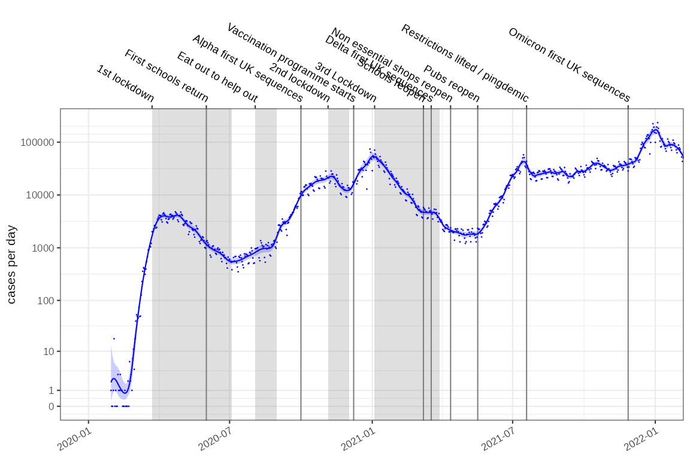
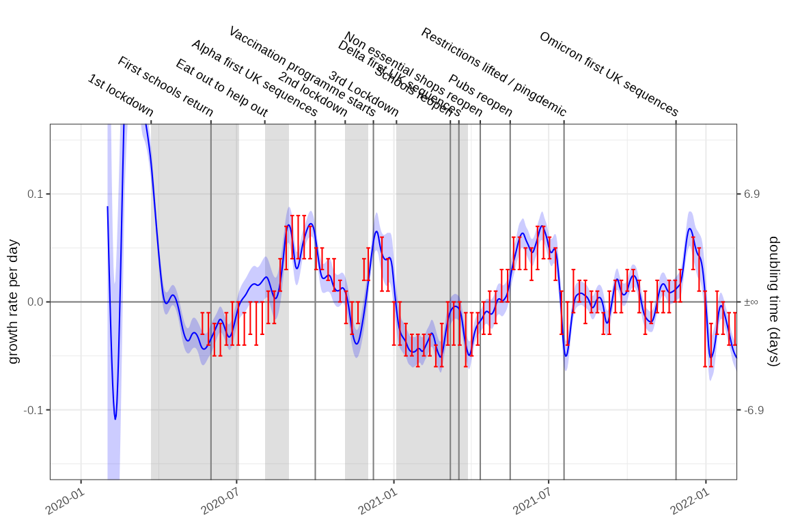
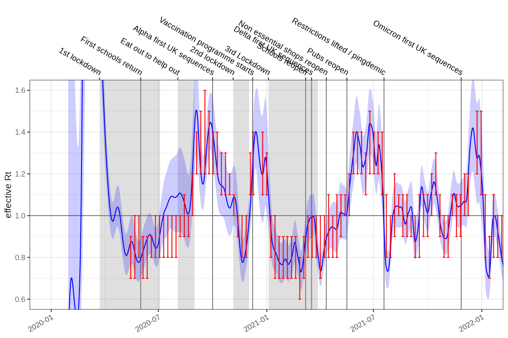
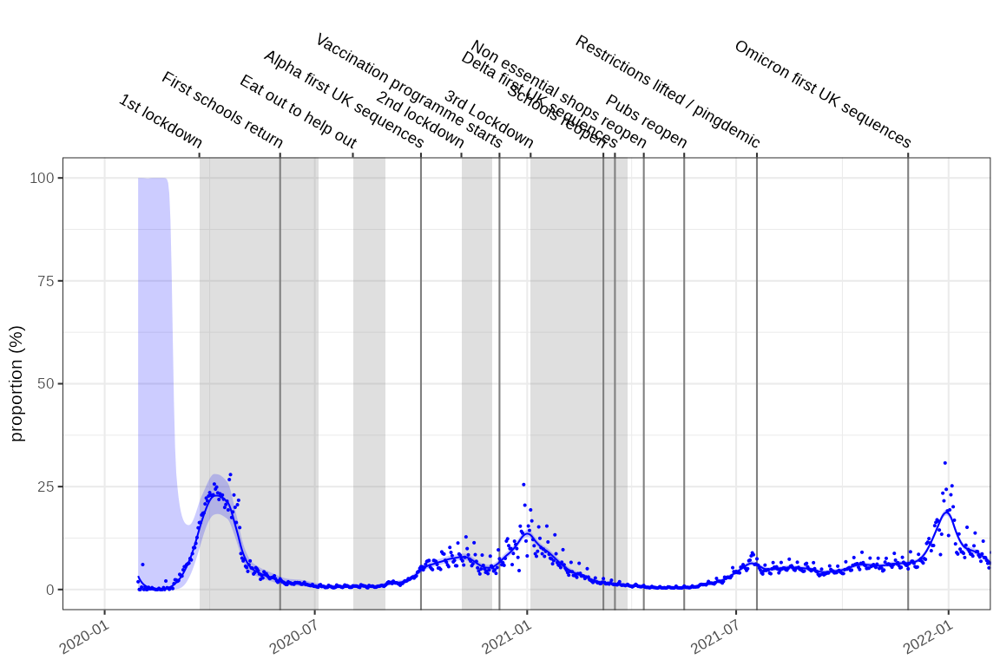
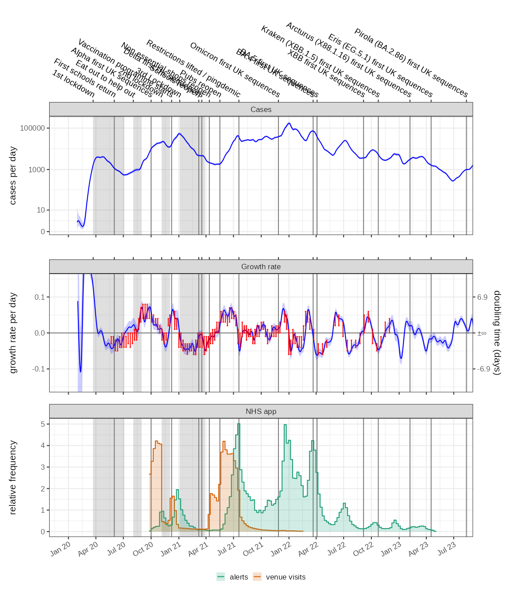

# England COVID-19 cases

## Incidence and growth rate from case positive counts

This method uses a case positive count dataset bundled with growth rates
which is age stratified (age grouping is in the `class` column). We will
look at the age stratification in different vignettes but in this
instance we want to aggregate it into an England wide rate. This is the
purpose of
[`time_aggregate()`](https://ai4ci.github.io/ggoutbreak/reference/time_aggregate.md)
which performs a simple summarisation.

``` r

example_england_covid_by_age() %>% dplyr::glimpse()
#> Rows: 26,790
#> Columns: 9
#> Groups: class [19]
#> $ class      <fct> 00_04, 05_09, 10_14, 15_19, 20_24, 25_29, 30_34, 35_39, 40_…
#> $ time       <t[day]> 32, 32, 32, 32, 32, 32, 32, 32, 32, 32, 32, 32, 32, 32, …
#> $ code       <chr> "E92000001", "E92000001", "E92000001", "E92000001", "E92000…
#> $ date       <date> 2020-01-30, 2020-01-30, 2020-01-30, 2020-01-30, 2020-01-30…
#> $ name       <chr> "England", "England", "England", "England", "England", "Eng…
#> $ codeType   <chr> "CTRY20", "CTRY20", "CTRY20", "CTRY20", "CTRY20", "CTRY20",…
#> $ count      <dbl> 0, 0, 0, 0, 1, 0, 0, 0, 0, 0, 1, 0, 0, 0, 0, 0, 0, 0, 0, 0,…
#> $ denom      <dbl> 2, 2, 2, 2, 2, 2, 2, 2, 2, 2, 2, 2, 2, 2, 2, 2, 2, 2, 2, 2,…
#> $ population <dbl> 3299637, 3538206, 3354246, 3090232, 3487863, 3801409, 38079…

data = example_england_covid_by_age() %>%
  time_aggregate(count=sum(count))
```

The raw COVID-19 case count on a `log1p` scale is the total detected
cases per day.

``` r
fit = data %>%
   poisson_locfit_model() 

plot_incidence(fit,raw = data, colour="blue",size=0.025)+
  scale_y_log1p(n=7)
```


Major events in the timeseries can be plotted on the axes. We’ve
focussed on the first 2 years of the pandemic:

``` r
plot_incidence(fit, raw = data, events = ukc19::timeline, colour="blue",size=0.025)+
  scale_y_log1p(n=7) + ggplot2::coord_cartesian(xlim=as.Date(c("2020-01-01","2022-01-01")))
```



The incidence model assumes case rates result from a Poisson process and
the rate is estimated with a time varying locally fitted polynomial with
degree defined by the `deg` parameter, using a log link function,
according to the methods of Loader et al. (see
`utils::citation("locfit")`). The fitting process is a local maximum
likelihood estimation and uses a bandwidth defined to account for the
data points within `window` of the time point being estimated.

The gradient of the fitted polynomial on the log scale, is the
exponential growth rate. This is a scale independent view of the rate of
growth of the epidemic. This estimation methodology is compared to
consensus estimates from the SPI-M-O UK government advisory group in
red, shifted forward in time by 14 days. The SPI-M-O estimates made
during the pandemic were retrospective whereas these ones can use
information from before and after the time point and now may better
represent the timing of changes.

``` r

plot_growth_rate(fit,events = ukc19::timeline, colour="blue")+
  ggplot2::coord_cartesian(xlim=as.Date(c("2020-01-01","2022-01-01")), ylim=c(-0.15,0.15))+
  ggplot2::geom_errorbar(data=ukc19::spim_consensus, ggplot2::aes(x=date-14,ymin=growth.low,ymax=growth.high),colour="red")
```



The state of the epidemic is described by both incidence and growth, and
the phase plots allow us to see both at different time points. In this
case the epidemic state in the 10 weeks leading up to Christmas in 2021,
2022 and 2023:

``` r


plot_growth_phase(fit,
    timepoints = as.Date(c("Xmas 2020"="2020-12-25","Xmas 2021"="2021-12-25","Xmas 2022"="2022-12-25")),
    duration = 70, 
    interval = 7,
    colour="blue",
    strip.position = "top"
)
```


## Reproduction number estimation

The growth rate has a unit or “per day” in this example. From it we can
derive the reproduction number, using the methods of Wallinga and
Lipsitch and an estimate of the infectivity profile of COVID-19. This
describes the probability that an infectee is infected x days after the
infector, and includes a temporal dimension rendering the reproduction
number a dimensionless quantity reflecting the average number of
infectees resulting from each infector.

We also have methods to infer the reproduction number from modelled
incidence estimates where logarithmic link functions are used. This is
described in the vignette:
[`vignette("rt-from-incidence", package="ggoutbreak")`](https://ai4ci.github.io/ggoutbreak/articles/rt-from-incidence.md)

`ggoutbreak` has an estimate of the infectivity profile based on a
meta-analysis of serial interval estimates of COVID-19. The infectivity
profile is a bootstrapped set of discrete probability distributions. It
is truncated at 14 days.

``` r

covid_ip = example_ganyani_ip()
ggoutbreak::plot_ip(ip=covid_ip, alpha=0.1)
```


As with before effective $`R_t`$ estimates are compared to consensus
values from the SPI-M-O group (red):

``` r

rt_fit = fit %>% ggoutbreak::rt_from_incidence(ip = covid_ip)

plot_rt(rt_fit, events = ukc19::timeline, colour="blue")+
  ggplot2::coord_cartesian(xlim=as.Date(c("2020-01-01","2022-01-01")), ylim=c(0.6,1.6))+
  ggplot2::geom_errorbar(data=ukc19::spim_consensus, ggplot2::aes(x=date-14,ymin=rt.low,ymax=rt.high),colour="red")
```



`EpiEstim` $`R_t`$ fits for comparison for the same data, and the same
infectivity profile are much more certain and exhibit some oscillation
due to the weekly periodicity of the underlying time series.

``` r

rt_epi_fit = data %>% ggoutbreak::rt_epiestim(ip = covid_ip,window = 14)

plot_rt(rt_epi_fit, events = ukc19::timeline, colour="blue")+
  ggplot2::coord_cartesian(xlim=as.Date(c("2020-01-01","2022-01-01")), ylim=c(0.6,1.6))+
  ggplot2::geom_errorbar(data=ukc19::spim_consensus,ggplot2::aes(x=date-14,ymin=rt.low,ymax=rt.high),colour="red")
```


## Prevalence and growth rate from test positivity rates

Test availability was not consistent during the pandemic. In the early
stages PCR tests were difficult to obtain and case positive incidence
estimates are thought to be a vast underestimate. During certain parts
of the pandemic targeted testing of high risk groups occurred. Test
positivity is a different view on the pandemic and accounts for some of
these biases and introduces others of its own. For this the data must
contain a `denom` column which in this case represents the number of
tests conducted:

``` r
england_covid_pcr_positivity = ukc19::england_covid_positivity %>% 
  dplyr::mutate(time = as.time_period(date)) %>%
  dplyr::group_by(code,name) %>%
  dplyr::glimpse()
#> Rows: 1,413
#> Columns: 7
#> Groups: code, name [1]
#> $ date     <date> 2020-01-30, 2020-01-31, 2020-02-01, 2020-02-02, 2020-02-03, …
#> $ code     <chr> "E92000001", "E92000001", "E92000001", "E92000001", "E9200000…
#> $ name     <chr> "England", "England", "England", "England", "England", "Engla…
#> $ count    <dbl> 1, 0, 0, 1, 18, 0, 1, 0, 0, 3, 1, 1, 4, 1, 1, 0, 0, 0, 1, 0, …
#> $ denom    <dbl> 53, 75, 165, 172, 297, 147, 155, 103, 186, 568, 583, 599, 887…
#> $ codeType <chr> "CTRY20", "CTRY20", "CTRY20", "CTRY20", "CTRY20", "CTRY20", "…
#> $ time     <t[day]> -330, -329, -328, -327, -326, -325, -324, -323, -322, -321…
```

``` r

fit2 = england_covid_pcr_positivity %>%
  dplyr::filter(denom !=0) %>%
  ggoutbreak::proportion_locfit_model()

plot_proportion(fit2, england_covid_pcr_positivity, events = ukc19::timeline, size=0.25, colour="blue")+
  ggplot2::coord_cartesian(xlim=as.Date(c("2020-01-01","2022-01-01")))
```



In this case the gradient of the proportion on the logistic scale is an
estimate of the growth rate. It is in some senses relative to the growth
of the testing effort but in this case produces an answer very similar
to the incidence model.

``` r

plot_growth_rate(fit2, events = ukc19::timeline, colour="blue")+
  ggplot2::coord_cartesian(xlim=as.Date(c("2020-01-01","2022-01-01")), ylim=c(-0.15,0.15))+
  ggplot2::geom_errorbar(data=ukc19::spim_consensus, ggplot2::aes(x=date-14,ymin=growth.low,ymax=growth.high),colour="red")
```


With similar growth rate estimates this method can also theoretically be
used to calculate estimates of $`R_t`$. Growth-proportion phase diagrams
can also compare different points in times or as we will see elsewhere,
between different populations.

``` r

plot_growth_phase(fit2,
    timepoints = as.Date(c("Xmas 2020"="2020-12-25","Xmas 2021"="2021-12-25","Xmas 2022"="2022-12-25")),
    duration = 70, 
    interval = 7,
    colour="blue"
)
```


## NHS COVID app

The NHS COVID-19 app performed digital contact tracing. The rate of
venue check-ins demonstrates the levels of high risk social contacts
however it became optional from Aug 2021. Self isolation alerts peaked
in Aug / Sept 2021 during the Delta wave and again in Dec 2021 / Jan
2022 in the Omicron wave. Periods of rapid growth precede increases in
the NHS app notifications. (N.B. data from
<https://www.gov.uk/government/publications/nhs-covid-19-app-statistics>)

``` r

p1 = plot_incidence(fit,events = ukc19::timeline, colour="blue", date_breaks="3 months")+
  ggplot2::coord_cartesian(xlim=as.Date(c("2020-01-01","2023-07-01")))+
  ggplot2::facet_wrap(~"Cases")+
  ggplot2::theme(axis.text.x.bottom = ggplot2::element_blank())+
  scale_y_log1p()

p2 = plot_growth_rate(fit,events = ukc19::timeline, colour="blue", date_breaks="3 months")+
  ggplot2::coord_cartesian(xlim=as.Date(c("2020-01-01","2023-07-01")), ylim=c(-0.15,0.15))+
  ggplot2::geom_errorbar(data=ukc19::spim_consensus,ggplot2::aes(x=date-21,ymin=growth.low,ymax=growth.high),colour="red")+
  ggplot2::facet_wrap(~"Growth rate")+
  ggplot2::theme(axis.text.x.bottom = ggplot2::element_blank(),axis.text.x.top = ggplot2::element_blank())

p3 = ggplot2::ggplot(ukc19::nhs_app)+
  geom_events(events=ukc19::timeline,hide_labels = TRUE)+
  ggplot2::geom_step(ggplot2::aes(x=date, y=alerts/mean(alerts, na.rm=TRUE),colour="alerts"))+
  ggplot2::geom_step(ggplot2::aes(x=date, y=visits/mean(visits, na.rm=TRUE),colour="venue visits"))+
  ggplot2::geom_rect(ggplot2::aes(xmin=date,xmax=dplyr::lead(date), ymin=0, ymax=alerts/mean(alerts, na.rm=TRUE),fill="alerts"), linewidth=0, alpha=0.2)+
  ggplot2::geom_rect(ggplot2::aes(xmin=date,xmax=dplyr::lead(date), ymin=0, ymax=visits/mean(visits, na.rm=TRUE),fill="venue visits"), linewidth=0, alpha=0.2)+
  ggplot2::coord_cartesian(xlim=as.Date(c("2020-01-01","2023-07-01")))+
  ggplot2::ylab("relative frequency")+
  ggplot2::xlab(NULL)+
  ggplot2::facet_wrap(~"NHS app")+
  ggplot2::scale_color_brewer(palette="Dark2", name=NULL, aesthetics = c("fill","colour"))+
  ggplot2::scale_x_date(date_breaks="3 months",date_labels = "%b %y")+
  ggplot2::theme(legend.position = "bottom")

p1+p2+p3+patchwork::plot_layout(ncol=1)
```



The weekly alerts data can be also modelled as a poisson process after
which it can be converted to a daily timeseries and aligned to the
incidence and growth rate data. With a fully aligned and modelled data
set we can test for granger causality:

``` r
alerts = ukc19::nhs_app %>% 
  dplyr::mutate(time = as.time_period(date)) %>%
  dplyr::rename(count = alerts) %>% 
  poisson_locfit_model() %>% 
  rescale_model("1 day") %>%
  dplyr::mutate(time = as.time_period(time, fit$time)) %>%
  dplyr::select(-dplyr::starts_with("growth")) %>%
  dplyr::rename_with(.cols = dplyr::starts_with("incidence"), .fn = ~ stringr::str_replace(.x,"incidence","alert")) %>%
  dplyr::inner_join(fit, by="time")

lmtest::grangertest(alert.0.5 ~ growth.0.5, order = 1, data=alerts)
#> Granger causality test
#> 
#> Model 1: alert.0.5 ~ Lags(alert.0.5, 1:1) + Lags(growth.0.5, 1:1)
#> Model 2: alert.0.5 ~ Lags(alert.0.5, 1:1)
#>   Res.Df Df      F    Pr(>F)    
#> 1    133                        
#> 2    134 -1 38.071 7.671e-09 ***
#> ---
#> Signif. codes:  0 '***' 0.001 '**' 0.01 '*' 0.05 '.' 0.1 ' ' 1
lmtest::grangertest(growth.0.5 ~ alert.0.5, order = 1, data=alerts)
#> Granger causality test
#> 
#> Model 1: growth.0.5 ~ Lags(growth.0.5, 1:1) + Lags(alert.0.5, 1:1)
#> Model 2: growth.0.5 ~ Lags(growth.0.5, 1:1)
#>   Res.Df Df      F Pr(>F)
#> 1    133                 
#> 2    134 -1 0.2767 0.5998

lmtest::grangertest(incidence.0.5 ~ alert.0.5, order = 1, data=alerts)
#> Granger causality test
#> 
#> Model 1: incidence.0.5 ~ Lags(incidence.0.5, 1:1) + Lags(alert.0.5, 1:1)
#> Model 2: incidence.0.5 ~ Lags(incidence.0.5, 1:1)
#>   Res.Df Df      F  Pr(>F)  
#> 1    133                    
#> 2    134 -1 4.9361 0.02799 *
#> ---
#> Signif. codes:  0 '***' 0.001 '**' 0.01 '*' 0.05 '.' 0.1 ' ' 1
lmtest::grangertest(alert.0.5 ~ incidence.0.5, order = 1, data=alerts)
#> Granger causality test
#> 
#> Model 1: alert.0.5 ~ Lags(alert.0.5, 1:1) + Lags(incidence.0.5, 1:1)
#> Model 2: alert.0.5 ~ Lags(alert.0.5, 1:1)
#>   Res.Df Df      F Pr(>F)
#> 1    133                 
#> 2    134 -1 0.0658 0.7979
```

The conclusion of this test would be that growth is more predictive of
alerts rather than vice versa, but much of this depends on the precise
timing of the recorded data which may be subject to reporting delays, as
well as any time delays that result from the modelling.
