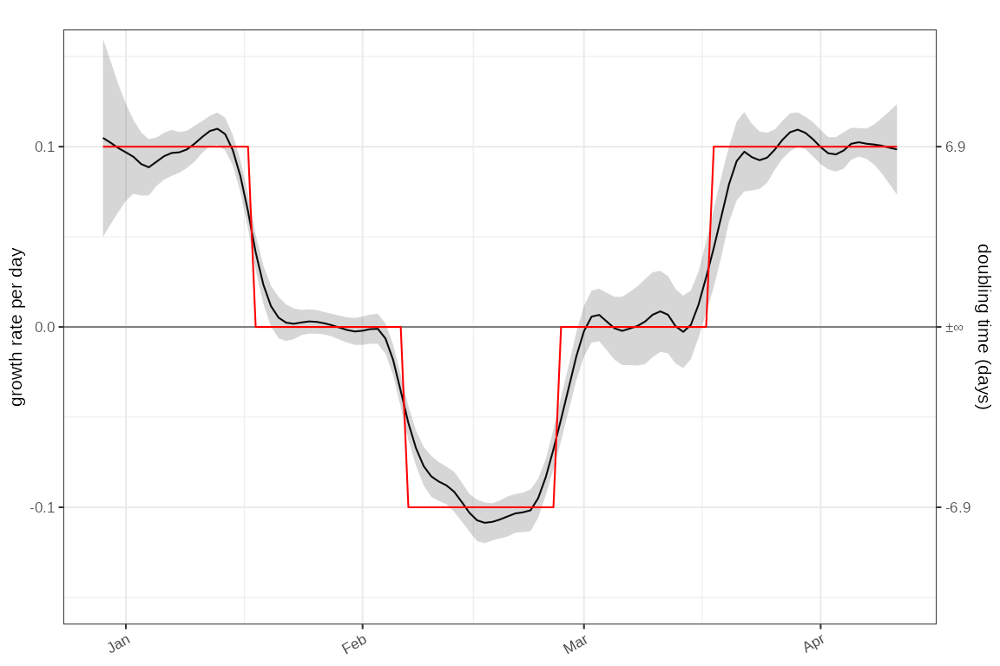
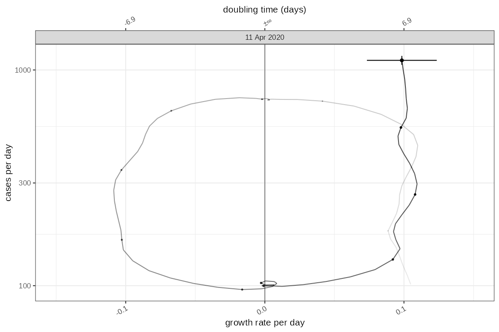
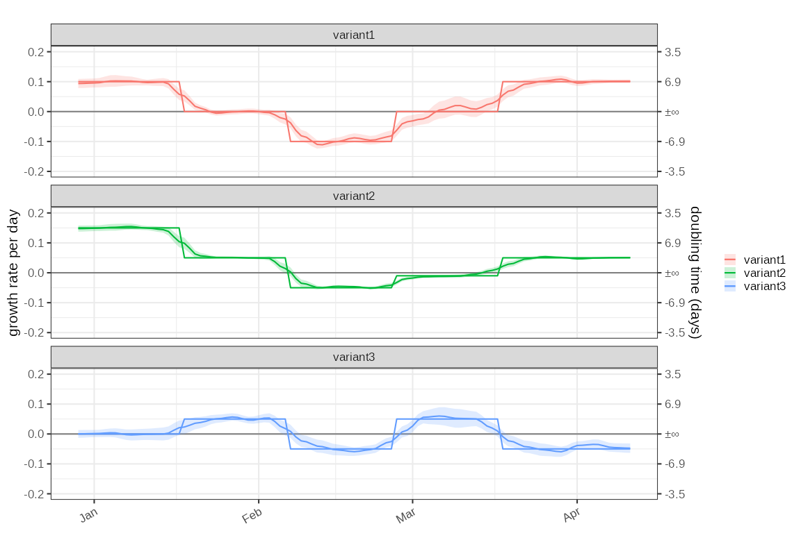
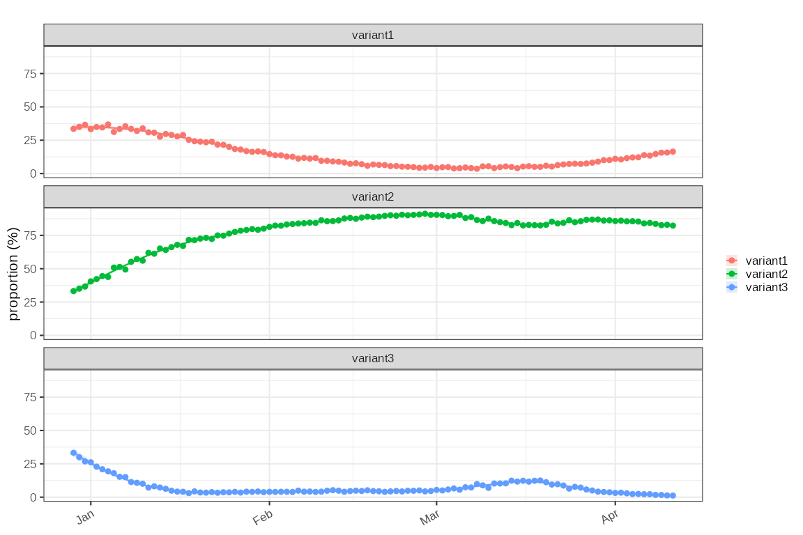
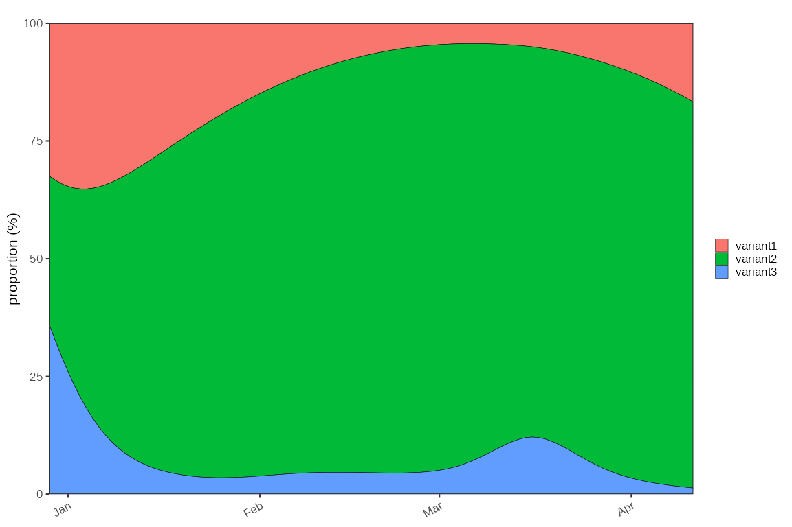
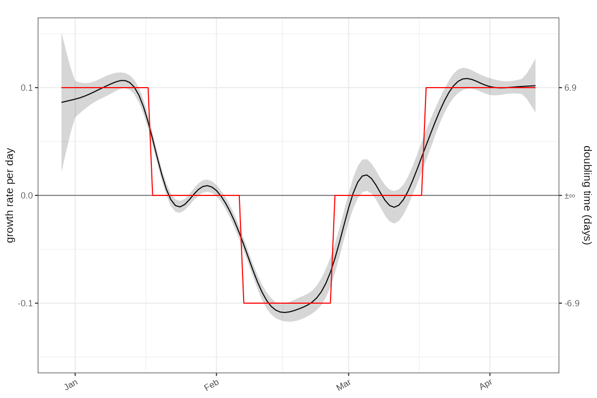
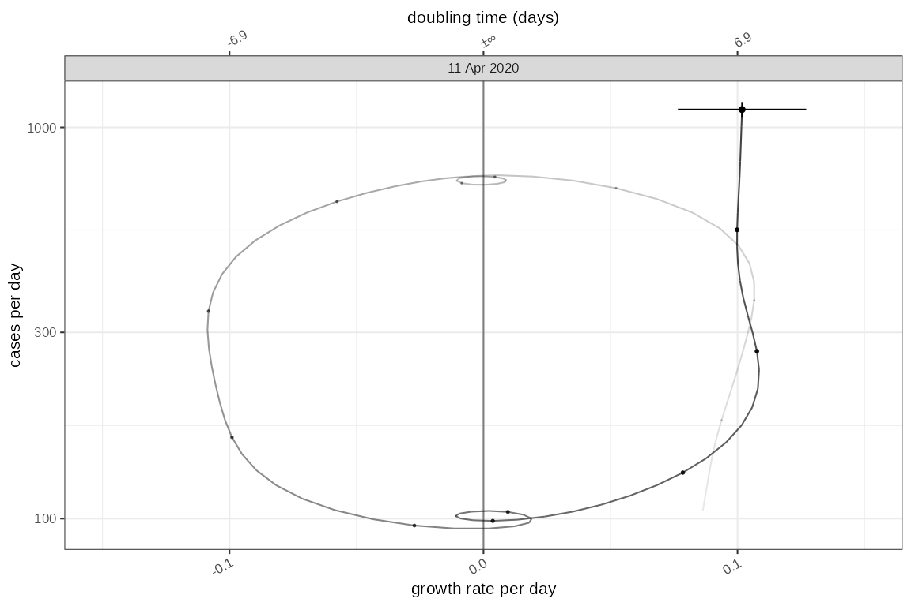
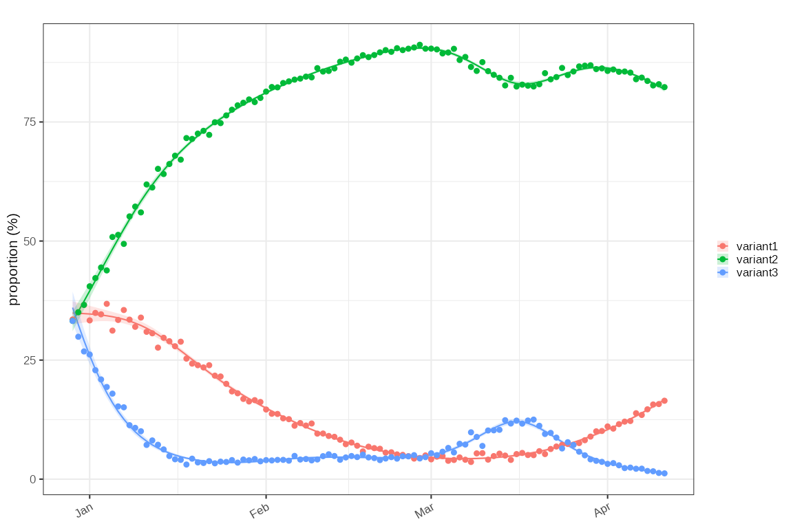

# Simulation tests for growth rate estimators

This test data is based around a known time varying exponential growth
rate with an initial epidemic seed size of 100.

## Locfit models

### Simple incidence test with a poisson model

An incidence mode based on absolute counts:

``` r
data = sim_poisson_model()
data %>% dplyr::glimpse()
#> Rows: 105
#> Columns: 6
#> Groups: statistic [1]
#> $ time      <t[day]> 0, 1, 2, 3, 4, 5, 6, 7, 8, 9, 10, 11, 12, 13, 14, 15, 16,…
#> $ growth    <dbl> 0.1, 0.1, 0.1, 0.1, 0.1, 0.1, 0.1, 0.1, 0.1, 0.1, 0.1, 0.1, …
#> $ imports   <dbl> 100, 0, 0, 0, 0, 0, 0, 0, 0, 0, 0, 0, 0, 0, 0, 0, 0, 0, 0, 0…
#> $ rate      <dbl> 100.0000, 110.5171, 122.1403, 134.9859, 149.1825, 164.8721, …
#> $ count     <int> 89, 99, 130, 132, 139, 154, 180, 232, 227, 252, 275, 309, 36…
#> $ statistic <chr> "infections", "infections", "infections", "infections", "inf…
```

``` r
tmp = data %>% poisson_locfit_model(window=7, deg = 2)

plot_incidence(tmp, data)+ggplot2::geom_line(
  mapping=ggplot2::aes(x=as.Date(time),y=rate), data=data, colour="red",inherit.aes = FALSE)
```


Estimated absolute growth rate versus simulation (red)

``` r

plot_growth_rate(tmp)+
  ggplot2::geom_line(mapping=ggplot2::aes(x=as.Date(time),y=growth), data=data, colour="red",inherit.aes = FALSE)
```



``` r

plot_growth_phase(tmp)
```



### Multinomial data

Multiple classes are simulated as 3 independent epidemics (‘variant1’,
‘variant2’ and ‘variant3’) with known growth rates and initial sample
size resulting in 3 parallel time series. These are combined to give an
overall epidemic and a proportional distribution of each ‘variant’ as a
fraction of the whole. A relative growth rate is calculated based on set
parameters.

``` r
data2 = sim_multinomial() %>% dplyr::group_by(class) %>% dplyr::glimpse()
#> Rows: 315
#> Columns: 10
#> Groups: class [3]
#> $ time            <t[day]> 0, 1, 2, 3, 4, 5, 6, 7, 8, 9, 10, 11, 12, 13, 14, 1…
#> $ growth          <dbl> 0.1, 0.1, 0.1, 0.1, 0.1, 0.1, 0.1, 0.1, 0.1, 0.1, 0.1,…
#> $ imports         <dbl> 100, 0, 0, 0, 0, 0, 0, 0, 0, 0, 0, 0, 0, 0, 0, 0, 0, 0…
#> $ rate            <dbl> 100.0000, 110.5171, 122.1403, 134.9859, 149.1825, 164.…
#> $ count           <int> 110, 105, 132, 144, 151, 174, 198, 207, 245, 260, 268,…
#> $ statistic       <chr> "infections", "infections", "infections", "infections"…
#> $ class           <chr> "variant1", "variant1", "variant1", "variant1", "varia…
#> $ proportion      <dbl> 0.3333333, 0.3382826, 0.3420088, 0.3445125, 0.3458146,…
#> $ proportion.obs  <dbl> 0.3503185, 0.3230769, 0.3646409, 0.3711340, 0.3842239,…
#> $ relative.growth <dbl> 0.025000000, 0.019385523, 0.013833622, 0.008404115, 0.…
```

#### Poisson model

Firstly fitting the same incidence model in a groupwise fashion:

``` r
tmp2 = data2 %>% poisson_locfit_model(window=7, deg = 1)

plot_incidence(tmp2, data2)+scale_y_log1p()
```


And the absolute growth rates:

``` r
plot_growth_rate(modelled = tmp2)+
   ggplot2::geom_line(mapping=ggplot2::aes(x=as.Date(time),y=growth, colour=class), data=data2, inherit.aes = FALSE)+
   ggplot2::facet_wrap(dplyr::vars(class), ncol=1)
```



#### One versus others Binomial model

This looks at the proportions of the three variants and their growth
rate relative to each other:

``` r
# This will reinterpret total to be the total of positives across all variants
data3 = data2 %>% 
  dplyr::group_by(time) %>% 
  dplyr::mutate(denom = sum(count)) %>%
  dplyr::group_by(class) %>%
  dplyr::glimpse()
#> Rows: 315
#> Columns: 11
#> Groups: class [3]
#> $ time            <t[day]> 0, 1, 2, 3, 4, 5, 6, 7, 8, 9, 10, 11, 12, 13, 14, 1…
#> $ growth          <dbl> 0.1, 0.1, 0.1, 0.1, 0.1, 0.1, 0.1, 0.1, 0.1, 0.1, 0.1,…
#> $ imports         <dbl> 100, 0, 0, 0, 0, 0, 0, 0, 0, 0, 0, 0, 0, 0, 0, 0, 0, 0…
#> $ rate            <dbl> 100.0000, 110.5171, 122.1403, 134.9859, 149.1825, 164.…
#> $ count           <int> 110, 105, 132, 144, 151, 174, 198, 207, 245, 260, 268,…
#> $ statistic       <chr> "infections", "infections", "infections", "infections"…
#> $ class           <chr> "variant1", "variant1", "variant1", "variant1", "varia…
#> $ proportion      <dbl> 0.3333333, 0.3382826, 0.3420088, 0.3445125, 0.3458146,…
#> $ proportion.obs  <dbl> 0.3503185, 0.3230769, 0.3646409, 0.3711340, 0.3842239,…
#> $ relative.growth <dbl> 0.025000000, 0.019385523, 0.013833622, 0.008404115, 0.…
#> $ denom           <int> 314, 325, 362, 388, 393, 490, 565, 637, 658, 762, 828,…
```

Firstly proportions:

``` r

tmp3 = data3 %>% proportion_locfit_model(window=14, deg = 2)

plot_proportion(modelled = tmp3,raw = data3)+
  ggplot2::facet_wrap(dplyr::vars(class), ncol=1)
```



And secondly relative growth rate:

``` r


plot_growth_rate(modelled = tmp3)+
   ggplot2::geom_line(mapping=ggplot2::aes(x=as.Date(time),y=relative.growth, colour=class), data=data2, inherit.aes = FALSE)+
   ggplot2::facet_wrap(dplyr::vars(class), ncol=1)
```


``` r

plot_growth_phase(tmp3)
```


#### Multinomial model

The multinomial model gives us absolute proportions only (and no growth
rates)

``` r
# we don't need to calculate the denominator as it is done automatically by the 
# multinomial model

tmp4 = data2 %>% multinomial_nnet_model()
#> # weights:  30 (18 variable)
#> initial  value 355466.992121 
#> iter  10 value 179300.960957
#> iter  20 value 176149.623005
#> final  value 174429.728510 
#> converged
plot_multinomial(tmp4)
```



``` r

# plot_multinomial(tmp3, events = event_test,normalise = TRUE)
```

## GLM models

### Poisson model

Run a poisson model on input data using `glm` this returns incidence
only. Derived growth rates can be estimated by using a savitsky-golay
filter based approach.

``` r

tmp5 = data %>% poisson_glm_model(window=7) %>% growth_rate_from_incidence()
plot_incidence(tmp5,data)
```


``` r

plot_growth_rate(tmp5)+
  ggplot2::geom_line(mapping=ggplot2::aes(x=as.Date(time),y=growth), data=data, colour="red",inherit.aes = FALSE)
```



``` r

plot_growth_phase(tmp5)
```



### Binomial model

Run a binomial model on input data using `glm` this returns absolute
proportions only and derived growth rates are not at this point
supported.

``` r

tmp6 = data3 %>% proportion_glm_model(window=14, deg = 2)
plot_proportion(tmp6,data3)
```


