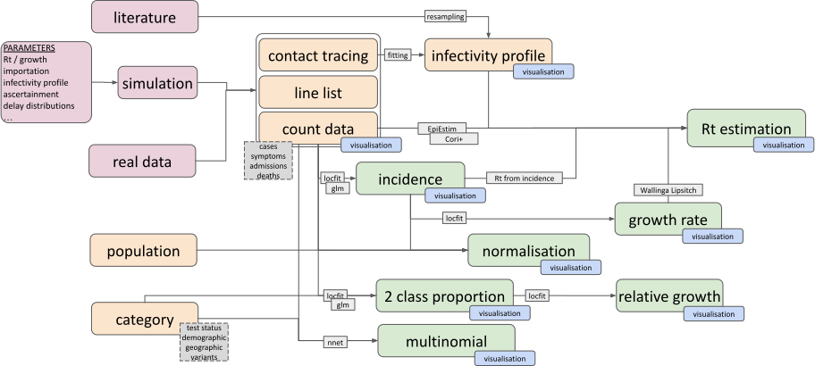

# Getting started with \`ggoutbreak\`

### Background

A collection of tools from COVID-19 with focus on simplicity and a goal
to provide a simple pipeline from data to visualisation. The main
features are listed below. The documentation is in development. For the
time being the best resources are the other vignettes including:

- [`vignette("covid-timeseries",package="ggoutbreak")`](https://ai4ci.github.io/ggoutbreak/articles/covid-timeseries.md)
- [`vignette("incidence-trends",package="ggoutbreak")`](https://ai4ci.github.io/ggoutbreak/articles/incidence-trends.md)
- [`vignette("variant-proportions",package="ggoutbreak")`](https://ai4ci.github.io/ggoutbreak/articles/variant-proportions.md)
- [`vignette("weekly-incidence",package="ggoutbreak")`](https://ai4ci.github.io/ggoutbreak/articles/weekly-incidence.md)
- [`vignette("rt-from-incidence",package="ggoutbreak")`](https://ai4ci.github.io/ggoutbreak/articles/rt-from-incidence.md)
- [`vignette("simulation-test-models",package="ggoutbreak")`](https://ai4ci.github.io/ggoutbreak/articles/simulation-test-models.md)

### Installation

`ggoutbreak` is hosted on the [AI4CI
r-universe](https://ai4ci.r-universe.dev/). Installation from there is
as follows:

``` r
options(repos = c(
  "ai4ci" = 'https://ai4ci.r-universe.dev/',
  CRAN = 'https://cloud.r-project.org'))

# Download and install ggoutbreak in R
install.packages("ggoutbreak")
```

You can install the development version of `ggoutbreak` from
[GitHub](https://github.com/ai4ci/ggoutbreak) with:

``` r
# install.packages("devtools")
devtools::install_github("ai4ci/ggoutbreak")
```

### Features

Simulation

- Poisson (aggregate count) & branching process (line list)
- Time varying parametrisations
- Test harness for estimators, including scoring metrics.

Estimation

- Collection of methods for incidence, growth rate, reproduction number
  (and wrappers for existing tools)
- Poisson count and binomial/multinomial proportion models

Visualization

- Default `ggplot2` visualisations of epidemic time series, including
  adjustment for population and variable time steps.



Pipeline functions

## Simulation

### Models:

- Poisson growth rate (count model)
- Poisson reproduction number (count model)
- Branching process model (individual model)
- SEIR ODE (compartment model)

### Time varying parameters:

- Rt / growth rate / transmission
- Importation
- Generation time
- Ascertainment
- Delay to observation, e.g. symptoms, admissions, death
- Contact matrices
- Dispersion

### Scoring

- `mean_quantile_bias` - the average of the universal residuals. Lower
  values are better.
- `mean_bias` - the bias on the natural scale (which may be interpreted
  as additive or multiplicative depending on the link)
- `pit_was` - an unadjusted probability integral transform histogram
  Wasserstein distance from the uniform (lower values are better).
- `unbiased_pit_was` - an PIT Wasserstein distance from the uniform,
  adjusted for estimator bias (lower values are better). This is a
  measure of calibration.
- `directed_pit_was` - a PIT Wasserstein distance from the uniform,
  directed away from the centre, adjusted for estimator bias (values
  closer to zero are better, positive values indicate overconfidence,
  and negative values excessively conservative estimates).
- `percent_iqr_coverage` - the percentage of estimators that include the
  true value in their IQR. For a perfectly calibrated estimate this
  should be 0.5. Lower values reflect overconfidence, higher values
  reflect excessively conservative estimates. This is a measure of
  calibration but is influenced by bias.
- `unbiased_percent_iqr_coverage` - the percentage of estimators that
  include the true value in their IQR once adjusted for bias. This
  should be 0.5. This is a measure of calibration, and tells you which
  direction (smaller numbers are over-confident, larger values
  excessively conservative).
- `mean_prediction_interval_width_50` - the prediction interval width is
  a measure of sharpness (smaller values are sharper). Sharper
  estimators are superior if they are unbiased and well calibrated.
- `mean_crps` - the mean value of the continuous rank probability score
  for each point estimate (lower values are better)
- `threshold_misclassification_probability` - if a metric has a natural
  threshold like 1 for $`R_t`$ then this measures how probable it is
  that the estimate will propose the epidemic is shrinking when it is
  growing and vice versa. Lower is better.

## Estimation methods

- Rapid simple estimates.
- All methods can operate over multiple sub-group time series.
- Supports daily / weekly / monthly / yearly time series\*
- Testing estimators against simulations.

### Infectivity profile estimation

- Estimation of generation time or serial interval from published
  estimates (including uncertainty)
- Resampled from raw interval data (with bootstrapping for uncertainty)
  from posterior estimates of a fitted gamma distribution

### Poisson rate models

- Locfit or GLM fitted time varying quasipoisson model.
- GAM models including adjustment for right censoring.
- Estimates incidence and growth rate
- Normalisation per capita population or to population baseline rate

### Binomial proportion models

- Locfit or GLM fitted time varying quasibinomial model.
- Estimates proportion and relative growth rate
- Normalisation against population baseline risk

### Multinomial proportion models

- `nnet` based multinomial proportion models.

### $`R_t`$ estimation methods:

#### EpiEstim wrapper

Simple adaptor for EpiEstim reference method

#### Reimplementation of Cori method

- Inputs raw incidence time series
- Reimplementation integrates estimates from a range of time windows
- Handles missing data.
- Less lag and more uncertainty.

#### Wallinga and Lipsitch growth rates method

- Inputs an exponential growth rate time series estimate (assumed
  normally distributed)
- Uses MGF of discrete SI distribution
- Monte-Carlo resampling for propagation of uncertainty
- Moderately slow

#### $`R_t`$ from modelled incidence

- Inputs a log-normally distributed incidence estimate.
- Propagates uncertainty in infectivity profile and incidence data
- Deterministic & tolerant of missing values.
- Can use incidence model derived from weekly count time series.
- Can deal with negative values in serial interval

#### Bootstrapped renewal eqaution

- Inputs distributional for of incidence estimate.
- Uses resampling to propagate uncertainty in incidence and infectivity
  profile
- Non deterministic, can use weekly time-series
