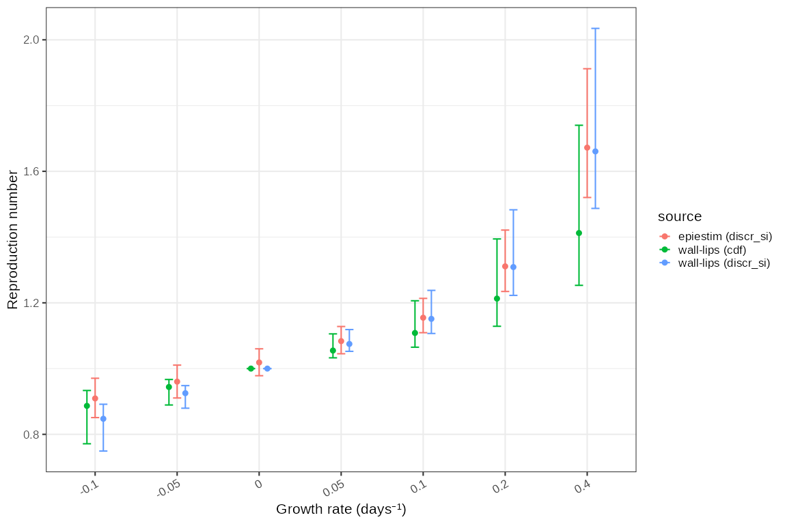

# Infectivity profile discretisation

Estimation of the infectivity profile is usually done by fitting a
doubly censored survival model with an underlying gamma probability
distribution to data and can be done with MCMC using `EpiEstim`. In this
case we demonstrate this with a mock Rotavirus dataset from `EpiEstim`:

``` r
clever_init_param <- EpiEstim::init_mcmc_params(si_data, "G")
SI_fit_clever <- coarseDataTools::dic.fit.mcmc(dat = si_data,
  dist = "G", # Gamma distribution
  init.pars = clever_init_param,
  burnin = 1000,
  n.samples = 5000,
  verbose = 10000)
```

    ## Running 6000 MCMC iterations 
    ## MCMCmetrop1R iteration 1 of 6000 
    ## function value =  -31.86869
    ## theta = 
    ##   -0.14075
    ##    0.54710
    ## Metropolis acceptance rate = 1.00000
    ## 
    ## 
    ## 
    ## @@@@@@@@@@@@@@@@@@@@@@@@@@@@@@@@@@@@@@@@@@@@@@@@@@@@@@@@@
    ## The Metropolis acceptance rate was 0.55667
    ## @@@@@@@@@@@@@@@@@@@@@@@@@@@@@@@@@@@@@@@@@@@@@@@@@@@@@@@@@

``` r
SI_fit_clever
```

    ## Coarse Data Model Parameter and Quantile Estimates: 
    ##         est CIlow CIhigh
    ## shape 1.078 0.480  2.331
    ## scale 1.344 0.618  3.762
    ## p5    0.090 0.004  0.337
    ## p50   1.048 0.538  1.679
    ## p95   4.214 2.835  8.007
    ## p99   6.368 4.130 13.218
    ## Note: please check that the MCMC converged on the target distribution by running multiple chains. MCMC samples are available in the mcmc slot (e.g. my.fit@mcmc)

The median estimate and confidence intervals are quantiles of the
posterior samples each of which define a candidate gamma distribution.
The density of a subset of these are plotted here.

``` r
# The sample quantiles
# apply(SI_fit_clever@samples,MARGIN = 2,FUN = quantile, p=c(0.5,0.025,0.975))

gammas = SI_fit_clever@samples %>% 
  dplyr::transmute(
    rate = 1/var2, 
    shape = var1, 
    scale = var2, 
    mean = var1*var2, 
    sd = sqrt(var1)*var2, 
    lmean = log(mean), 
    lsd = log(sd))

max_x = ceiling(stats::quantile(stats::qgamma(0.95, gammas$shape, gammas$rate),0.75))

if (is.null(si_distr)) si_distr = EpiEstim::discr_si(0:max_x, stats::quantile(gammas$mean, 0.5), stats::quantile(gammas$sd, 0.5))

ggplot2::ggplot()+
  purrr::pmap(gammas %>% utils::tail(200), 
    function(shape,rate,...) {
      ggplot2::geom_function(fun = function(x) stats::dgamma(x, shape=shape, rate=rate), alpha=0.05, xlim=c(0,max_x))
    }
  )+
  ggplot2::ylab("density")
```


Alternatives to generating these infectivity profile distributions from
data are examined in the vignette “Sampling the infectivity profile from
published serial interval estimates”, and include resampling from
published estimates.

Estimation of $`R_t`$ using `EpiEstim` requires that the infectivity
profile estimates are discretised. As the underlying Cori method
requires that the probability of infection at day zero is zero,
`EpiEstim` discretises the infectivity profile distributions using a
offset gamma distribution which requires that the mean of the
infectivity profile distribution is greater than 1. This results in some
MCMC fitted distributions being unsuitable especially in this case where
the mean is short.

If we are using a framework for estimating $`R_t`$ that does not have
this requirement a more natural discretisation using the the cumulative
density of the untransformed gamma distribution and cut points based on
0.5 day intervals is possible.

``` r
original_disc = gammas %>%
  dplyr::filter(mean > 1) %>%
  dplyr::transmute(
    coll = dplyr::row_number(),
    disc = purrr::map2(mean,sd, ~ dplyr::tibble(
                         a0 = c(0,seq(0.5,length.out = 50)),
                        a = seq(0.5,length.out = 51),
                         p = EpiEstim::discr_si(0:50, .x, .y))),
    disc_type = "discr_si"
) %>% tidyr::unnest(disc)

cdf_disc = gammas %>%
    dplyr::transmute(
      discr = purrr::map2(
        shape, rate, ~ dplyr::tibble(
          a0 = c(0,seq(0.5,length.out = 50)),
          a = seq(0.5,length.out = 51),
          p = dplyr::lead(stats::pgamma(a, .x ,.y),default = 1) - stats::pgamma(a, .x ,.y)
        )
      ),
      coll = dplyr::row_number(),
      disc_type = "cdf"
    ) %>% tidyr::unnest(discr)


tmp = dplyr::bind_rows(original_disc,cdf_disc) %>% 
  dplyr::mutate(disc_type=factor(disc_type, levels = c("discr_si","cdf")))

sources = length(levels(tmp$disc_type))

tmp_summ = tmp %>% dplyr::group_by(source = disc_type,a0,a) %>% dplyr::summarise(p = mean(p))
```

    ## `summarise()` has grouped output by 'source', 'a0'. You can override using the
    ## `.groups` argument.

``` r
# tmp_mean = tmp %>% dplyr::group_by(source = disc_type,coll) %>% 
#   dplyr::summarise(mean = sum(a*p)) %>% 
#   dplyr::summarise(sd = stats::sd(mean),mean = mean(mean), parameter="mean") %>%
#   dplyr::bind_rows(
#     gammas %>% dplyr::summarise(sd = stats::sd(mean),mean=mean(mean), parameter="mean",source="none")
#   )

ggplot2::ggplot(tmp %>% dplyr::rename(source = disc_type))+
  ggplot2::geom_segment(mapping=ggplot2::aes(x=a0,xend=a,y=p, colour=source), alpha=0.01)+
  ggplot2::geom_segment(data = tmp_summ, mapping=ggplot2::aes(x=a0,xend=a,y=p), colour="black")+
  ggplot2::xlab("time")+
  ggplot2::coord_cartesian(xlim=c(0,max_x+1))+
  ggplot2::guides(colour = ggplot2::guide_legend(override.aes = list(alpha = 1)))+
  ggplot2::facet_wrap(~source)
```


``` r
# tmp_mean
```

This alternative discretisation will affect reproduction number
estimation. We might expect that for a given growth rate the
reproduction number would be less for the `cdf` discretisation as the
mass of the probability looks lower. This would mean that more
generations of the epidemic can be expected in a unit time and hence any
observed exponential growth per unit time is due to fewer secondary
infections per primary infection.

We test this with a fixed value of the growth rate, and the
Wallinga-Lipsitch method of estimating reproduction number from growth
rate, for both types of discretisation. The Wallinga-Lipsitch method can
use arbitrary limits for the discretisation of the infectivity profile
and hence can produce an estimate with infectivity profiles that are
impossible to use in `EpiEstim`. For comparison the result of estimating
$`R_t`$ using `EpiEstim`, and using the `discr_si` strategy is also
included.

``` r
R_t = tmp %>% tidyr::nest(dist = c(p,a,a0)) %>% 
  tidyr::crossing(r = c(0.4,0.2,0.1,0.05,0,-0.05,-0.1)) %>%
  dplyr::mutate(
    R_t = purrr::map2_dbl(r, dist, ~ ggoutbreak::wallinga_lipsitch(.x, y = .y$p, a0 = .y$a0, a = .y$a)),
    source = sprintf("wall-lips (%s)",disc_type)
  ) %>%
  dplyr::filter(!is.na(R_t))
  
R_t_summ = R_t %>% dplyr::group_by(r,source) %>% dplyr::summarise(
  median = stats::quantile(R_t,0.5),
  lower = stats::quantile(R_t,0.025),
  upper = stats::quantile(R_t,0.975)
)
```

    ## `summarise()` has grouped output by 'r'. You can override using the `.groups`
    ## argument.

``` r
r = c(0.4,0.2,0.1,0.05,0,-0.05,-0.1)

# select a shorter list of samples
tmp2 = tmp %>% 
  dplyr::filter(disc_type == "discr_si") %>%
  dplyr::group_by(source = disc_type) %>% dplyr::reframe(
  si_matrix = list(matrix(as.vector(p),nrow=51)[,1:250]),
  r = list(r)
) %>% tidyr::unnest(r)

# tmp2$si_matrix[[1]][1:10,1:10]

compare_R = tmp2 %>% dplyr::mutate(R = purrr::map2(si_matrix, r, ~ {
  ts = dplyr::tibble(
        t = 0:30
      ) %>% dplyr::mutate(
        I = 100*exp(.y*t)
      )
  return(EpiEstim::estimate_R(ts, 
      method="si_from_sample", si_sample = .x,
      config = EpiEstim::make_config(t_start=2, t_end = 30))$R)
  })
)
```

    ## Warning: There were 7 warnings in `dplyr::mutate()`.
    ## The first warning was:
    ## ℹ In argument: `R = purrr::map2(...)`.
    ## Caused by warning:
    ## ! Unknown or uninitialised column: `dates`.
    ## ℹ Run `dplyr::last_dplyr_warnings()` to see the 6 remaining warnings.

``` r
plot2data = compare_R %>% tidyr::unnest(R) %>% dplyr::glimpse()
```

    ## Rows: 7
    ## Columns: 14
    ## $ source              <fct> discr_si, discr_si, discr_si, discr_si, discr_si, …
    ## $ si_matrix           <list> <<matrix[51 x 250]>>, <<matrix[51 x 250]>>, <<mat…
    ## $ r                   <dbl> 0.40, 0.20, 0.10, 0.05, 0.00, -0.05, -0.10
    ## $ t_start             <dbl> 2, 2, 2, 2, 2, 2, 2
    ## $ t_end               <dbl> 30, 30, 30, 30, 30, 30, 30
    ## $ `Mean(R)`           <dbl> 1.7543441, 1.3511354, 1.1751333, 1.0957564, 1.0250…
    ## $ `Std(R)`            <dbl> 0.16244367, 0.07642027, 0.04090425, 0.02835450, 0.…
    ## $ `Quantile.0.025(R)` <dbl> 1.5016885, 1.2292047, 1.1086763, 1.0469306, 0.9805…
    ## $ `Quantile.0.05(R)`  <dbl> 1.5251242, 1.2403353, 1.1156855, 1.0536505, 0.9873…
    ## $ `Quantile.0.25(R)`  <dbl> 1.6415567, 1.2973633, 1.1463599, 1.0754958, 1.0089…
    ## $ `Median(R)`         <dbl> 1.7170525, 1.3348355, 1.1679082, 1.0929499, 1.0242…
    ## $ `Quantile.0.75(R)`  <dbl> 1.8721513, 1.4079964, 1.2034030, 1.1140078, 1.0405…
    ## $ `Quantile.0.95(R)`  <dbl> 2.005677, 1.468689, 1.243300, 1.145625, 1.064894, …
    ## $ `Quantile.0.975(R)` <dbl> 2.1923755, 1.5507611, 1.2776107, 1.1588705, 1.0734…

``` r
ggplot2::ggplot(R_t_summ )+
  ggplot2::geom_point(ggplot2::aes(y=median, x = factor(r), colour = source), position=ggplot2::position_dodge(width=0.4))+
  ggplot2::geom_errorbar(ggplot2::aes(ymin=lower, ymax=upper, x = factor(r), colour = source), width=0.2,position=ggplot2::position_dodge(width=0.4))+
  ggplot2::geom_point(data = plot2data, mapping=ggplot2::aes(y=`Median(R)`, x = factor(r), colour="epiestim (discr_si)"))+
  ggplot2::geom_errorbar(data = plot2data, mapping=ggplot2::aes(ymin=`Quantile.0.025(R)`, ymax=`Quantile.0.975(R)`, x = factor(r), colour="epiestim (discr_si)"), width=0.1)+
  ggplot2::xlab("Growth rate (days⁻¹)")+ggplot2::ylab("Reproduction number")
```



We see a noticeably less extreme estimate for the reproduction number
when the infectivity profile is discretised with the unadjusted `cdf`
strategy compared with the `EpiEstim` inbuilt `discr_si` strategy. This
is worse as the growth rate increases, with `discr_si` based estimates
being un to 20% higher in extreme growth rate scenarios. The bias will
be accentuated in this example as it contains a very short serial
interval, which makes the discretisation error more apparent. We would
expect to see much less bias due to discretisation if dealing with
diseases with longer serial intervals.

## Conclusion

The methods involved in `EpiEstim` require that the infectivity profile
is a discrete probability distribution and that the probability of
transmission at time zero is zero. For diseases with a shorter serial
interval, these constraints are difficult to resolve, and discretisation
of the infectivity profile distribution using a offset 1 gamma
distribution results in an unusual shape to the discrete distribution.
In the Wallinga-Lipsitch framework for estimating the reproduction
number from the growth rate these constraints do not apply and we can
compare `EpiEstim`s discretisation approach to one that is closer to the
originally estimated continuous distribution, but which requires that
the framework can handle a non zero probability of transmission on day
zero. This comparison suggests that discretisation may bias `EpiEstim`s
estimates of the reproduction number by up to 20% when growth rates are
high, or even higher when compared to the equilibrium point of
$`R_t=1`$. Alternative strategies for discretisation and frameworks that
relax the requirement for a probability of infection of zero at time
zero will benefit from further investigation particularly for diseases
with a shorter serial interval.
