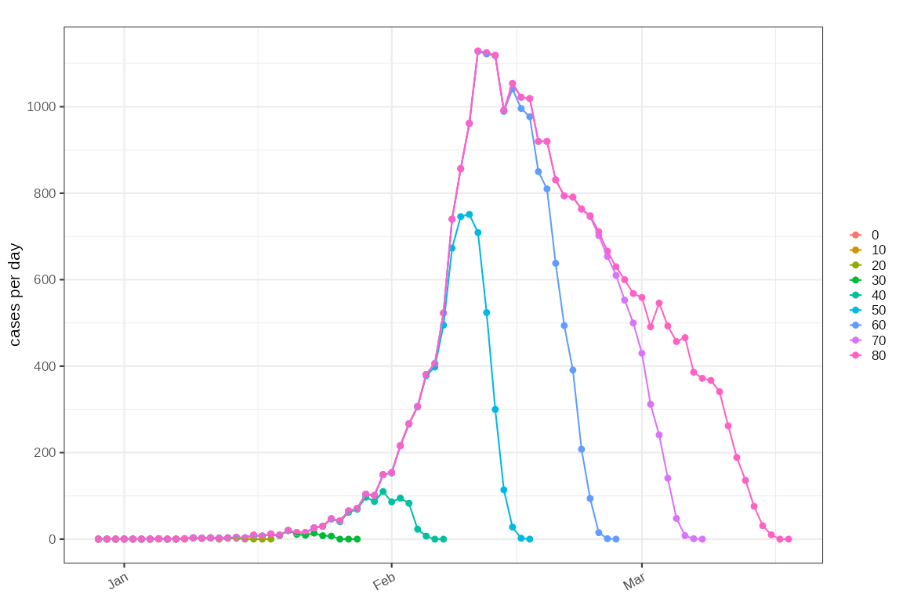
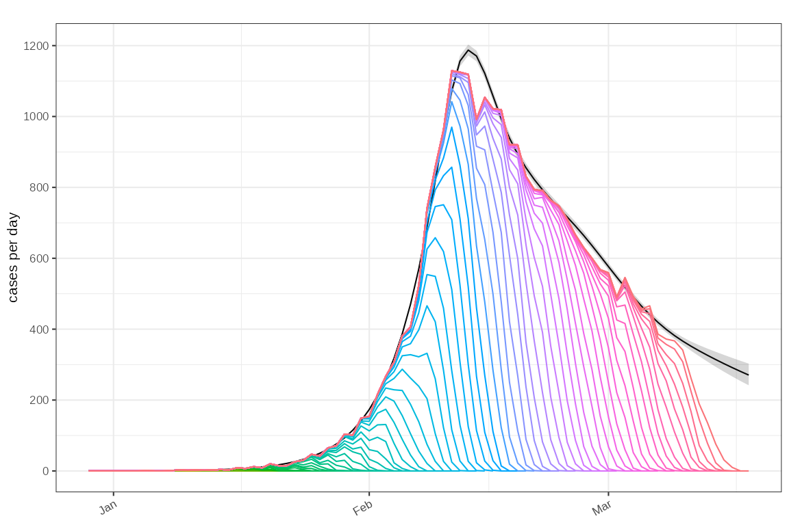
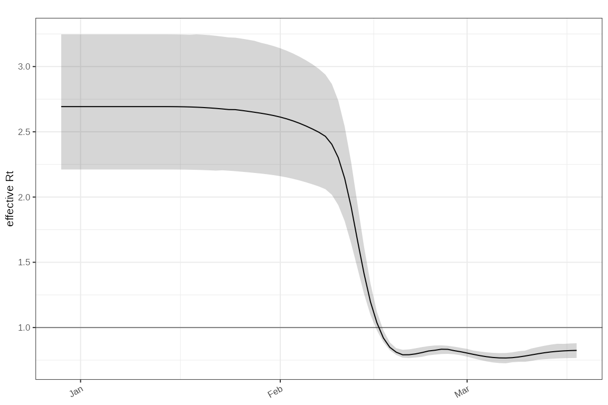

# Estimating the reproduction number from right censored data

## Background

Right censoring typically is seen in epidemiological data as a result of
delays observing a proportion of patients.

## Simulation

TODO: setup simulation.

``` r

# changes = dplyr::tribble(
#   ~t,    ~r,
#   0,      0,
#   5,     0.2,
#   10,     0.1,
#   20,     0,
#   25,     -0.1,
#   35,     -0.05,
#   45,     0.1
# )


# 
# bpm = sim_branching_process(seed = 100) %>%
#   ggoutbreak::sim_apply_delay() %>%
#   glimpse()
# 
# 
# # timeseries counts by observation day:
# # All of this is observation delay (not physiological delay)
# # sample results available when with result (sample date)
# # admissions and deaths delayed reporting.
# # test results available immediately (reporting date)
# # symptoms available immediately
# 
# delayed_counts = bpm %>%
#   ggoutbreak::sim_summarise_linelist(
#     censoring = list(
#       admitted = function(t) rgamma2(t, mean = 5),
#       death = function(t) rgamma2(t, mean = 10),
#       sample = function(t, result_delay) result_delay
#     ),
#     max_time = 0:80
#   )
# 
# plot_counts(
#   delayed_counts %>% filter(obs_time %% 10 == 0),
#   mapping = aes(colour = labels(obs_time))
# ) +
#   geom_line() +
#   facet_wrap(~statistic, scales = "free_y")
# 
# test_delayed_observation = delayed_counts %>%
#   filter(statistic == "admitted") %>%
#   select(statistic, obs_time, time, count) %>%
#   glimpse()


sim = example_delayed_observation()
plot_counts(sim %>% dplyr::filter(floor(obs_time) %% 5==0), mapping = ggplot2::aes(colour=factor(obs_time)))+
  ggplot2::geom_line()
```



Fit a GAM with a delay term in it:

``` r
model = gam_delayed_reporting(knots_fn = ~ c(15,30,40,45,50,60,70,75))
poisson_gam = sim %>% poisson_gam_model(
  model_fn = model$model_fn,
  predict = model$predict,
  ip=example_ip())
```

Plot the fitted incidence accounting for non observed cases:

``` r
plot_incidence(poisson_gam)+
    ggplot2::geom_line(
       data=sim,
       mapping = ggplot2::aes(x=as.Date(time),y=count,colour=as.factor(obs_time))
       )+
    ggplot2::guides(colour=ggplot2::guide_none())
```



Plot the associated $`R_t`$ estimate:

``` r
plot_rt(poisson_gam, events = sim_events(sim),
        ip = example_ip())
```


