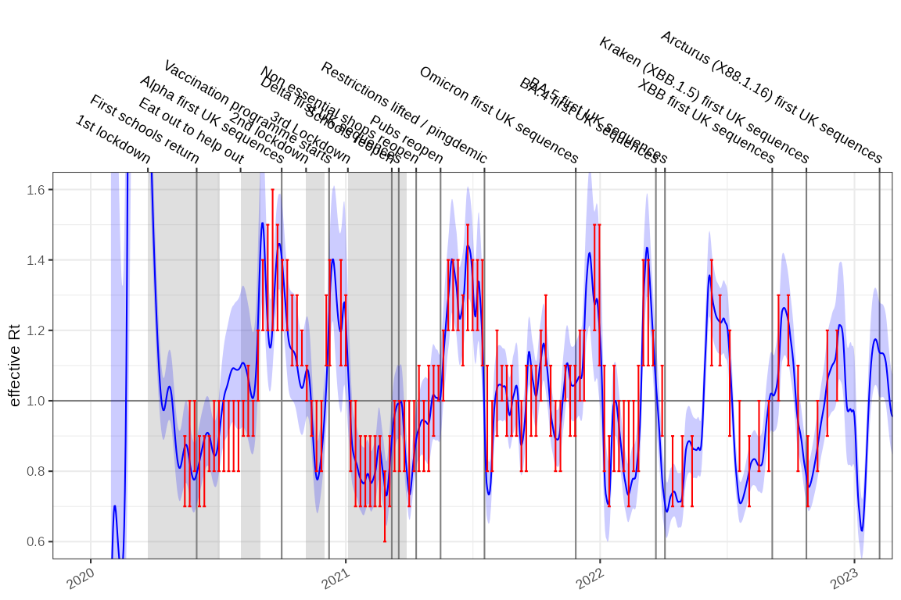

# Estimating the reproduction number from modelled incidence

Robert Challen ^(1,2); Leon Danon ^(1,2);

1.  Engineering Mathematics, University of Bristol, Bristol, UK
2.  AI4CI

## Introduction

If we have estimated the incidence of a disease $`I_t`$ using a poisson
rate using maximum likelihood estimators, the rate is typically a
log-normally distributed with parameters $`\mu`$ and $`\sigma`$. Such a
fitted model is shown below on a log1p scale, for the COVID-19 epidemic
in England:


It is appealing to use this modelled incidence estimate to calculate an
estimate of the reproduction number, $`R_t`$. Incidence models can be
derived in a number of ways, they are easily inspected for error and can
be made tolerant of missing values and outliers.

## Methods

To use a modelled estimate of incidence to predict $`R_t`$ we need to
propagate uncertainty in incidence into our $`R_t`$ estimates. To
calculate $`R_t`$ we can use the backwards-looking renewal equations
which incorporate the infectivity profile of the disease ($`\omega`$) at
a number of days after infection ($`\tau`$):

``` math

\begin{eqnarray}
\begin{aligned}
I_t &\sim Poisson(\lambda_t) \\
\lambda_t &\sim Lognormal(\mu_t,\sigma_t) \\
R_t &= \frac{I_t}{\sum_{\tau}{\omega_{\tau}I_{t-\tau}}}
\end{aligned}
\end{eqnarray}
```

In expectation, this gives:

``` math

\begin{eqnarray}
\begin{aligned}
R_t &\approx \frac{\lambda_t}{\sum_{\tau=1}^{k} \omega_\tau \lambda_{t-\tau}} \\
&\sim \frac{\text{Lognormal}(\mu_t, \sigma_t)}{\sum_{\tau=1}^{k} \text{Lognormal}\left( \mu_{t-\tau} + \log \omega_\tau, \sigma_{t-\tau} \right)}
\end{aligned}
\tag{1}
\end{eqnarray}
```

It has been shown that the sum of correlated log-normal distributed
random variables can be approximated by another log-normal with
parameters $`\mu_Z`$ and $`\sigma_Z`$, where the correlation between
them is $`\rho_{ij} = \text{Corr}(\log X_i, \log X_j)`$.

``` math

\begin{eqnarray}
\begin{aligned}
    S_+ &= \mathbb{E}\left[\sum_i X_i \right] = \sum_i
    \mathbb{E}[X_i] \\
    &= \sum_i e^{\mu_i + \frac{1}{2}\sigma_i^2}
    \\
    \sigma^2_{Z} &= \frac{1}{S_+^2} \, \sum_{i,j}
      \rho_{ij} \sigma_i \sigma_j \mathbb{E}[X_i] \mathbb{E}[X_j] \\
      &= \frac{1}{S_+^2} \, \sum_{i,j}
      \rho_{ij} \sigma_i \sigma_j e^{\mu_i+\frac{1}{2}\sigma_i^2}
      e^{\mu_j+\frac{1}{2}\sigma_j^2}
    \\
    \mu_Z &= \log S_+ - \frac{1}{2}\sigma_{Z}^2
\end{aligned}
\tag{2}
\end{eqnarray}
```

The sum term in the denominator of the renewal equation (1) consists of
a set of correlated scaled log normal distributions with scale defined
by the infectivity profile ($`\omega`$). For our case for a given time
point $`t`$ we equate $`X_i = \omega_{\tau} \lambda_{t-\tau}`$, and
substitute $`\mu_i`$ = $`\mu_{t-\tau} + log(\omega_{\tau})`$ and
$`\sigma_i = \sigma_{t-\tau}`$ into (2) to account for the infectivity
profile. We define $`k`$ to be the support of the infectivity profile
($`k = |\omega|`$). $`m_{s}`$ is the weighted contribution from
incidence estimates on day $`t-\tau`$, and $`\Sigma_{ij}`$ is the
covariance between log-incidence estimates from days $`t-i`$ and
$`t-j`$.

``` math

\begin{eqnarray}
\begin{aligned}
    m_{\tau} &= e^{\mu_{t-\tau} + \log \omega_{\tau} + \frac{1}{2}\sigma_{t-\tau}^2 } \\
    \Sigma_{ij} &= \text{Cov}(\log \lambda_{t-i}, \log \lambda_{t-j}) = \rho_{(t-i)(t-j)} \sigma_{t-i} \sigma_{t-j} \\
    S_{+} &= \sum_{\tau=1}^k { m_{\tau} } \\
    \sigma_{Z}^2 &=
      \frac{
        \sum_{i,j=1}^k {
          (m_{i} m_{j} \Sigma_{ij})
        }
      }{S_{+}^2}    \\
    \mu_{Z} &= \log S_+ - \frac{1}{2}\sigma_{Z}^2
\end{aligned}
\end{eqnarray}
```

With $`\mu_{Z}`$ and $`\sigma_{Z}`$ defined, $`R_t`$ is approximated as
the ratio of two log-normals where
$`\Sigma_{0Z} = \text{Cov}(\log \lambda_t, \log S)`$ is the covariance
between the numerator and the log-denominator. Since
$`S = \sum_\tau X_\tau`$, and using a first-order approximation, this
covariance is a weighted average of the covariances between
$`\log \lambda_t`$ and each $`\log \lambda_{t-\tau}`$, weighted by the
relative expected contributions $`m_\tau`$.:

``` math

\begin{eqnarray}
\tag{3}
\begin{aligned}
R_t &\sim \frac{Lognormal(\mu_t,\sigma_t)}
{Lognormal( \mu_{Z}, \sigma_{Z})} \\
\mu_{R_t} &= \mu_t - \mu_{Z} = \mu_t - \log S_+ + \frac{1}{2}\sigma_{Z}^2\\
\sigma_{R_t} &= \sqrt{\sigma_t^2+\sigma_{Z}^2 - 2 \Sigma_{0Z}} \\
\Sigma_{0Z} &= \frac{\sum_{\tau=1}^k m_\tau \Sigma_{0\tau}}{\sum_{\tau=1}^k m_\tau} = \frac{1}{S_+}\sum_{\tau=1}^k m_\tau \Sigma_{0\tau}\\
R_t &\sim Lognormal(\mu_{R_t}, \sigma_{R_t})
\end{aligned}
\end{eqnarray}
```

This formulation of $`R_t`$ from (3) assumes knowledge of the posterior
or prediction covariance of the incidence estimates ($`\Sigma_ij`$).
This is typical in modern frameworks , but in other situations may not
be available. In this case we could assume the individual estimates of
the incidence are independent, however this increases the uncertainty of
our $`R_t`$ estimate and in certain circumstances introduces a potential
underestimation bias, influenced by the true off-diagonal correlation
mass and the certainty of the incidence estimates. An alternative
approach is to assume weak stationarity and estimate a parametric
correlation model from the data used to build the incidence model, using
Pearson residuals to parameterise an exponential decay function based on
time difference (see supporting software package for implementation).
The degree of the bias is investigated further in the supplementary
materials, and heuristics for assessing the significance of this bias
proposed.

The method for estimating $`R_t`$ from modelled incidence has been
described assuming a non-negative component to the infectivity profile,
as it is implicit that infector and infectee are necessarily sequential
in time. In the situation where symptomatic case counts are used as a
proxy for incidence and the serial interval as a proxy for the
infectivity profile, negative times between serial cases may be observed
due to variation in delay in observation of the transmission chain.
There is nothing in this framework to stop the use of a negative time
for the infectivity profile, and we can directly support $`R_t`$
estimates in these cases.

### Numerical stability

In (3) $`\mu_t`$ is the log-scale mean of the incidence estimate at time
$`t`$, and $`\sigma_t`$ its standard deviation. These can be large,
leading to numerical instability in terms involving
$`\exp(\mu + \sigma^2)`$. However, assuming non-negative correlations
and using log-space computation with optimized log-sum-exp functions ,
the expressions remain computationally tractable:

``` math

\begin{eqnarray}
\begin{aligned}
\log m_\tau &= \mu_{t-\tau} + \log \omega_\tau + \frac{1}{2} \sigma_{t-\tau}^2 \\
\log S_+ &= \text{logsumexp}_\tau(\log m_\tau) \\
\log \sigma_Z^2 &= \text{logsumexp}_{i,j} \left( \log m_i + \log m_j + \log \Sigma_{ij} \right) - 2 \log S_+ \\
\log \Sigma_{0Z} &= \text{logsumexp}_\tau \left( \log m_\tau + \log \Sigma_{0\tau} \right) - \log S_+
\end{aligned}
\tag{4}
\end{eqnarray}
```

Other relations may be implemented directly as in (3).

### Infectivity profile uncertainty

This estimate of $`R_t`$ is conditioned on a single known infectivity
profile. In reality there is also uncertainty in the infectivity profile
($`\omega`$) which plays a role in the definition of $`\mu_{Z,t}`$ and
$`\sigma_{Z,t}`$. We cannot assume any particular distributional form
for the infectivity profile, but we can use a range of empirical
estimates of the infectivity profile to calculate multiple
distributional estimates for $`R_t`$ and then combine these as a mixture
distribution.

The nature of this mixture distribution will depend on the various
empirical infectivity profile distributions. However, we can use general
properties of mixture distributions to create estimates for the mean and
variance of the reproduction number estimate ($`R_t^*`$) combining the
uncertainty arising from multiple infection profile estimates
($`\Omega`$) and from the incidence estimate model itself:

``` math

\begin{eqnarray}
\begin{aligned}
E[R_t|\omega] &= e^{(\mu_{R_t,\omega} - \frac{1}{2}\sigma_{R_t,\omega}^2)} \\
V[R_t|\omega] &= \big[e^{(\sigma_{R_t,\omega}^2)} - 1\big] \big[e^{2 \mu_{R_t,\omega} + \sigma_{R_t,\omega}^2}\big] \\
E[R_t^*] &= \frac{1}{|\Omega|}\sum_{\omega \in \Omega} E[{R_t|\omega}] \\
V[R_t^*] &= \frac{1}{|\Omega|} \bigg[\sum_{\omega \in \Omega}{V[R_t|\omega]+E[R_t|\omega]^2}\bigg] - E[R_t^*]^2 \\
\end{aligned}
\end{eqnarray}
```

The cumulative distribution function of the mixture is simply the
arithmetic mean of the component cumulative distribution functions
(conditioned on each infectivity profile). If $`\Phi`$ is the cumulative
distribution function of the standard normal distribution:

``` math

\begin{eqnarray}
\begin{aligned}
F_{R_t^*}(x) &= \frac{1}{|\Omega|}\sum_{\omega \in \Omega}F_{R_t}(x|\omega) \\
P(R_t^* \le x) &= \frac{1}{|\Omega|}\sum_{\omega \in \Omega} P(R_{t,\omega} \le x) \\
P(R_t^* \le x) &= \frac{1}{|\Omega|}\sum_{\omega \in \Omega} \Phi\bigg(\frac{ln(x) - \mu_{R_t,\omega}}{\sigma_{R_t,\omega}}\bigg)
\end{aligned}
\end{eqnarray}
```

As the cumulative density function of this mixture distribution is a
strictly increasing function, specific solutions for median
($`q_{0.5}`$) and 95% confidence intervals ($`q_{0.025}`$ and
$`q_{0.975}`$) can be calculated numerically by solving the following
equations:

``` math

\begin{eqnarray}
\begin{aligned}
\frac{1}{|\Omega|}\sum_{\omega \in \Omega} \Phi\bigg(\frac{ln(q_{0.025}) - \mu_{R_t,\omega}}{\sigma_{R_t,\omega}}\bigg) - 0.025 &= 0 \\
\frac{1}{|\Omega|}\sum_{\omega \in \Omega} \Phi\bigg(\frac{ln(q_{0.5}) - \mu_{R_t,\omega}}{\sigma_{R_t,\omega}}\bigg) - 0.5 &= 0 \\
\frac{1}{|\Omega|}\sum_{\omega \in \Omega} \Phi\bigg(\frac{ln(q_{0.975}) - \mu_{R_t,\omega}}{\sigma_{R_t,\omega}}\bigg) - 0.975 &= 0
\end{aligned}
\end{eqnarray}
```

Numerical solutions to this are moderately expensive to perform. A
reasonable approximation can be expected by matching moments of a log
normal distribution to the mean $`E[R_t^*]`$ and variance $`V[R_t^*]`$
of the mixture. This gives us the final closed form estimator for the
reproduction number given a set of infectivity profiles,
$`\overline{R_{t,\Omega}}`$, as:

``` math

\begin{eqnarray}
\begin{aligned}
\mu_{t|\Omega} &= log\bigg(\frac{E[R_t^*]^2}{\sqrt{E[R_t^*]^2 + V[R_t^*]}}\bigg) \\
\sigma_{t|\Omega} &= \sqrt{log\bigg(1 + \frac{V[R_t^*]}{E[R_t^*]^2}\bigg)}\\
\overline{R_{t|\Omega}} &\sim Lognormal(\mu_{t|\Omega},\sigma_{t|\Omega})
\end{aligned}
\end{eqnarray}
```

In summary we present a method for retrieving the distributional form of
the reproduction number from log normally distributed probabilistic
estimates of incidence arising from simple statistical count models.
This includes uncertainty arising from both count models and from
infectivity profile distributions. It is fully deterministic and
computationally inexpensive. It does not place any particular
constraints on the nature of the infectivity profile distribution and
can handle distributions that have a negative component, as is sometimes
seen in serial interval estimates.

## Implementation

This method is implemented using the following R function, which is
designed for numerical stability and speed. Generating $`R_t`$ estimates
given modelled incidence typically occurring in a matter of seconds:

    #> function (mu_t, vcov_ij = diag(sigma_t^2), omega, sigma_t = NULL, 
    #>     tau_offset = 0) 
    #> {
    #>     omega_m = as.matrix(omega)
    #>     k = nrow(omega_m)
    #>     if (k != length(mu_t)) {
    #>         stop("omega must have the same number of rows as length of mu_t.")
    #>     }
    #>     if (!all(dim(vcov_ij) == k)) {
    #>         stop("vcov_ij must be a square matrix with the same dimensions as mu_t, and nrow(omega)")
    #>     }
    #>     omega_m = apply(omega_m, MARGIN = 2, rev)
    #>     sigma_t = sqrt(diag(vcov_ij))
    #>     time_Rt = length(mu_t) - tau_offset
    #>     mu = mu_t[time_Rt]
    #>     sigma = sigma_t[time_Rt]
    #>     tmp = apply(omega_m, MARGIN = 2, function(omega) {
    #>         log_m_tau = mu_t + sigma_t^2/2 + log(omega)
    #>         log_S_plus = .logsumexp(log_m_tau)
    #>         log_Sigma_ij = log(pmax(vcov_ij, 0))
    #>         log_Sigma_0tau = log_Sigma_ij[time_Rt, ]
    #>         log_sigma_Z2 = .logsumexp(outer(log_m_tau, log_m_tau, 
    #>             "+") + log_Sigma_ij) - 2 * log_S_plus
    #>         mu_Z = log_S_plus - 1/2 * exp(log_sigma_Z2)
    #>         log_Sigma_0Z = .logsumexp(log_m_tau + log_Sigma_0tau) - 
    #>             log_S_plus
    #>         mu_Rt = mu - mu_Z
    #>         sigma_Rt2 = sigma^2 + exp(log_sigma_Z2) - 2 * exp(log_Sigma_0Z)
    #>         return(c(mu_Rt, sigma_Rt2))
    #>     })
    #>     mu_Rt = tmp[1, ]
    #>     sigma_Rt2 = tmp[2, ]
    #>     means = exp(mu_Rt + sigma_Rt2/2)
    #>     vars = (exp(sigma_Rt2) - 1) * exp(2 * mu_Rt + sigma_Rt2)
    #>     mean_star = mean(means)
    #>     var_star = mean(vars + means^2) - mean_star^2
    #>     mu_star = log(mean_star) - log(var_star/mean_star^2 + 1)/2
    #>     sigma_star = sqrt(log(1 + var_star/mean_star^2))
    #>     return(list(time_Rt = time_Rt, mean_Rt_star = mean_star, 
    #>         var_Rt_star = var_star, meanlog_Rt_star = mu_star, sdlog_Rt_star = sigma_star, 
    #>         mu_Rt_mix = mu_Rt, sigma_Rt_mix = sqrt(sigma_Rt2), quantile_Rt_fn = function(p) {
    #>             .qmixlnorm(p, mu_Rt, sqrt(sigma_Rt2))
    #>         }))
    #> }
    #> <bytecode: 0x5eef167003a8>
    #> <environment: namespace:ggoutbreak>

## Results

Testing this against the incidence model shown above, and comparing the
results to the SPI-M-O consensus $`R_t`$ estimates gives us the
following time-series for England. This is formally evaluated elsewhere
but qualitatively is a good fit. It took a few seconds to calculate the
reproduction number from this single time series with 1410 time points ,
which opens up the possibility of performing $`R_t`$ estimates in fine
grained geographical or demographic subgroups.

    #>    user  system elapsed 
    #>   6.793   0.297   7.091



## Conclusion

We present a methodology for deriving $`R_t`$ from modelled estimates of
incidence while propagating uncertainty. We demonstrate it produces
satisfactory qualitative results against COVID-19 data. This method is
relatively quick, fully deterministic, and can be used on top of any
statistical models for estimating incidence which use logarithmic link
functions.
