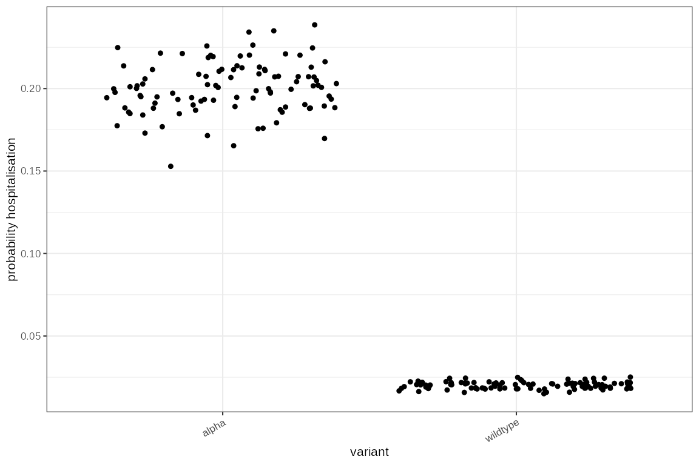
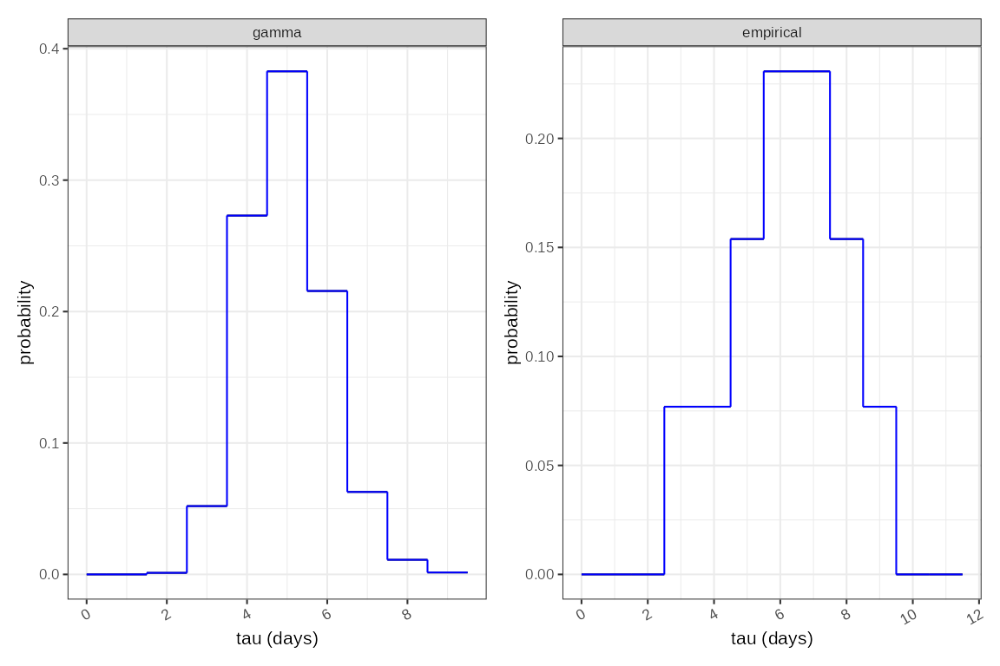
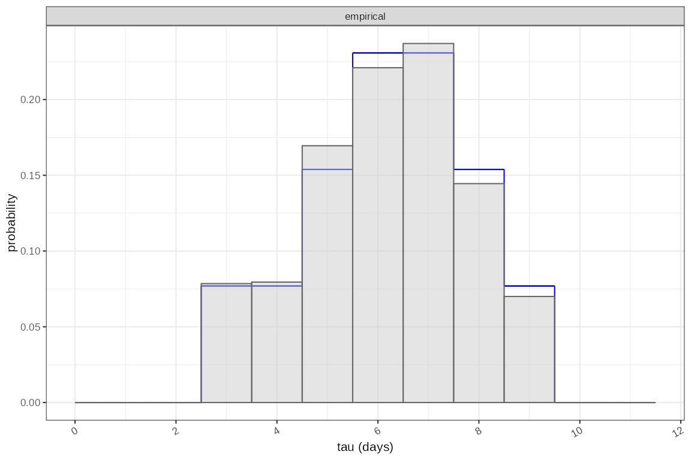
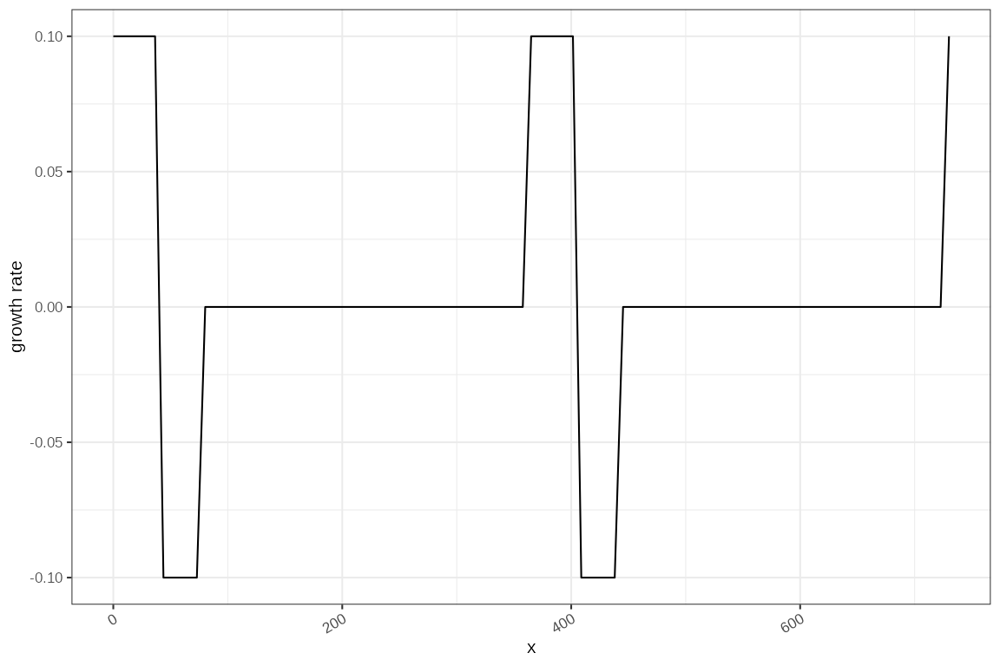
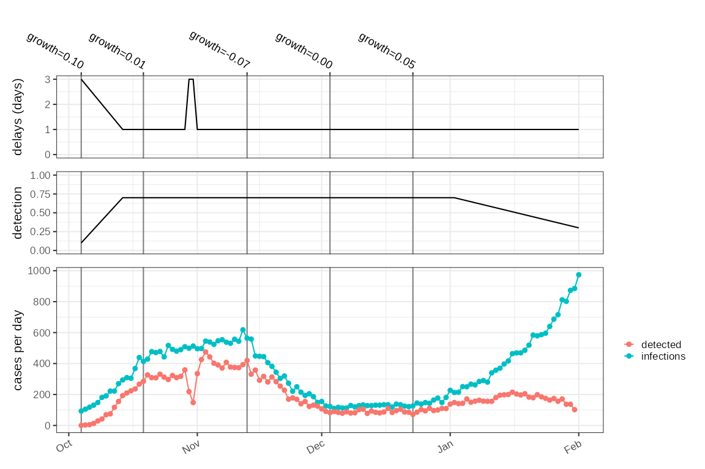
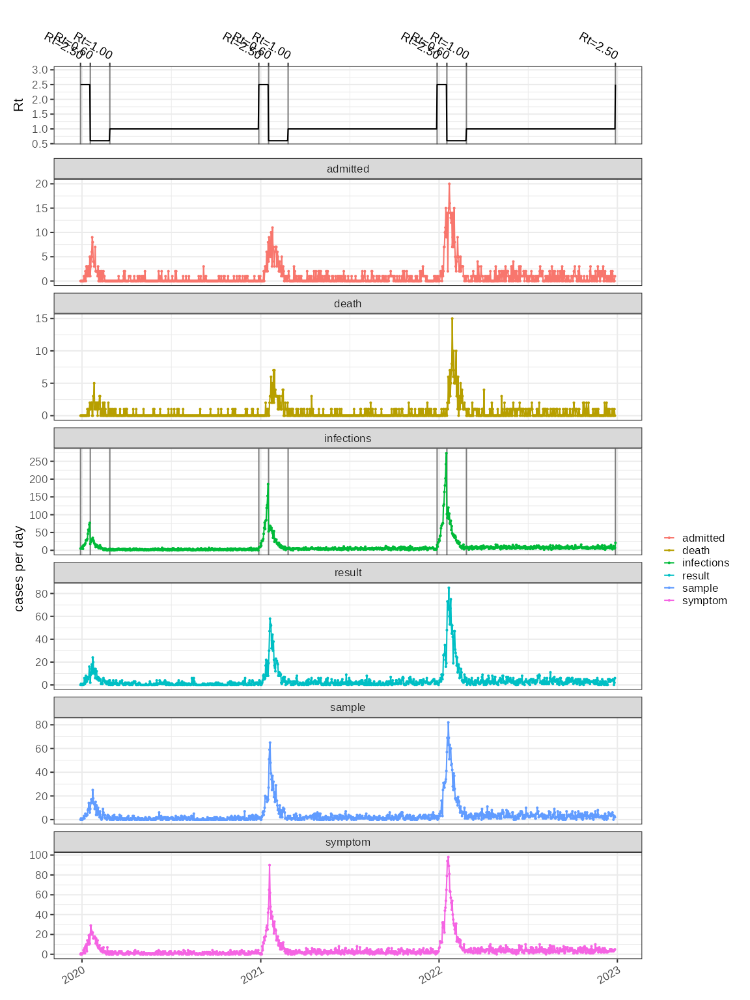
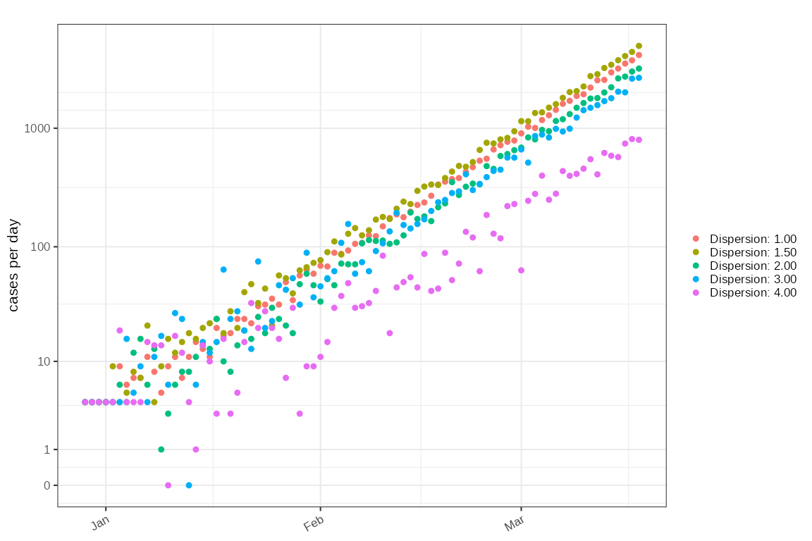
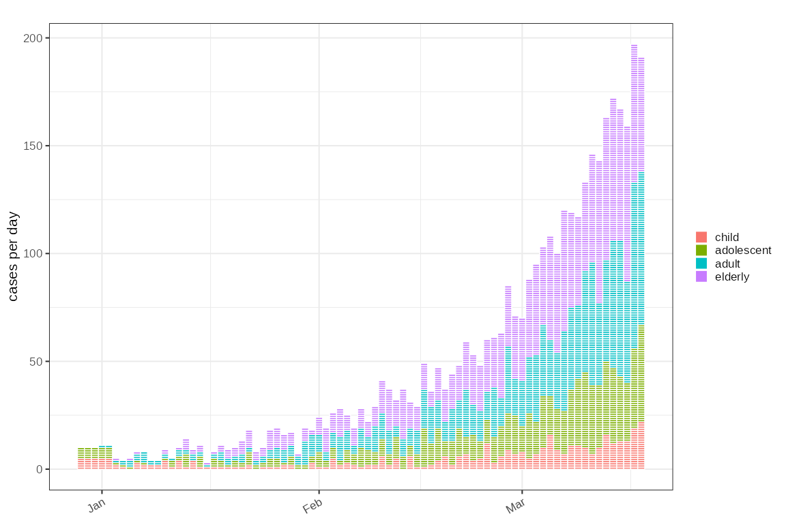

# Simulations and test harnesses

## Background

Testing the inference of $`R_t`$ and growth rate estimates needs a
ground truth, which is missing in real outbreaks as infection events
cannot be truly observed. Testing accuracy of estimates of $`R_t`$ for
example needs one or more simulations of outbreaks that have known
parametrisation. `ggoutbreak` contains some functions to generate
synthetic datasets which exhibit some of the complexities we observed in
the COVID-19 pandemic. There are two levels at which the simulations
work, aggregate counts or case line list simulations.

`ggoutbreak` includes a set of simulations that can be used to generate
test data with known parameters. These can be used to validate the
output of model parameter estimates, calculated from simulated data for
which we have gold standard values for those parameters. Simulations are
both at an aggregate level generating count data, or at an individual
level generating line lists.

The parameters implemented so far are as follows:

- Importation rate
- Reproduction number
- Growth rate
- Infectivity profile (generation time or the time delay of infectee
  infection from time of infector infection)
- Case ascertainment rate
- Probability of symptoms given infection
- Time delay of symptom onset from time of infection
- Probability of hospital admission given infection
- Time delay of hospital admission from time of infection
- Probability of death given infection
- Time delay of death from time of infection
- Probability of testing given infection (or given symptoms)
- Time delay of test sampling from time of infection (or symptoms)
- Time delay of test result from time of test sampling

Depending on the model some of these may be specified in different ways.
Different delays and rates of observation can be added ad-hoc and the
simulations can be stratified by different classes. In some simulations
this can be propagated using an equivalent to a contact matrix.

## Specifying time varying parameters

The simulation framework is highly configurable, and a key part of this
is specifying parameters that vary over time, or have some random or non
random day to day variation. Most simulation parameters must be given as
a time varying function, but other parameters are often available.
`ggoutbreak` includes various ways of generating these functions, and
simulation configuration options that expect a function are identified
by the `fn_...` prefix, for example `fn_p_symptomatic`.

Functions are evaluated in the context of the simulation data frame, as
it is being built. These will always have a time and a count column, and
may have other columns too. The evaluation happens internally but here
we use the `.ts_evaluate` function to demonstrate the results.

``` r
demo = dplyr::tibble(
  time = 0:9,
  class = rep(c("one","two"),5),
  flag = c(rep(TRUE,5),rep(FALSE,5))
)
```

A static value can be supplied as a purrr style lambda.

``` r
.ts_evaluate( ~ 0.5, demo )
#> [1] 0.5
```

A time varying function can be supplied as a purrr style lambda where
the first parameter is the `time` column of the `demo` dataframe

``` r
.ts_evaluate( ~ ifelse(.x < 5, 2, 0.5), demo )
#>  [1] 2.0 2.0 2.0 2.0 2.0 0.5 0.5 0.5 0.5 0.5
```

An alternative syntax uses an anonymous function with named parameters.
The time column is always shortened to `t`. This format can be used to
key off other variables to allow a time varying, and class specific
parameter to be returned

``` r
.ts_evaluate( function(t, class) dplyr::case_when(
  class == "one" ~ "variant 1 R_t value",
  class == "two" ~ "variant 2 R_t value"
), demo )
#>  [1] "variant 1 R_t value" "variant 2 R_t value" "variant 1 R_t value"
#>  [4] "variant 2 R_t value" "variant 1 R_t value" "variant 2 R_t value"
#>  [7] "variant 1 R_t value" "variant 2 R_t value" "variant 1 R_t value"
#> [10] "variant 2 R_t value"
```

If you don’t know what columns are available providing an empty or
otherwise incorrect function results in the valid parameter names being
displayed in the error message:

``` r
try(.ts_evaluate( function() {} , demo ))
#> Error : Function must define at least one parameter, available values are: t, class, flag
```

### Step and linear functions

A common need is to set a number of fixed levels, or fixed knots and
have the function interpolate between them. The step function might be
used to parametrise $`R_t`$ in the event of a lock-down for example.

To make this simple most simulation functions will take a `changes`
dataframe that defines the time point and the new value of, either the
reproduction number or the growth rate at the time point. These can be
used as parametrisation for the reproduction number.

``` r

changes = dplyr::tibble(
  t = c(0,20,40,60,80), 
  growth = c(0.1,0,-0.1,0,0.1)
)

fn = cfg_step_fn(changes)
ggplot2::ggplot()+ggplot2::geom_function(fun = fn, xlim = c(0,100))+ggplot2::ylab("growth rate")
```


`cfg_linear_fn` produces a very similar effect with less abrupt changes
in $`R_t`$ and changes occurring such that the value at the knot is
correct.

``` r

changes = dplyr::tibble(
  t = c(0,10,20,30,40,50,60,70,80), 
  R = c(1,1.5,1.75,1.25,0.9,0.7,0.8,0.95,1)
)

fn = cfg_linear_fn(changes)
ggplot2::ggplot()+
  ggplot2::geom_function(fun = fn, xlim = c(0,100))+ggplot2::ylab("reproduction number")+
  ggplot2::geom_hline(yintercept=1,linetype="dashed")
```


### Random functions

For some applications (e.g. ascertainment, importation) it might useful
to have a value that includes some random noise, but with the an
expected value of the average. This is easiest with a `purrr` style
lambda.

``` r
# A random normally distributed value with mean 5 and SD 1
# `.x` here will be interpreted as time as the first parameter, and in this
# case is only used to size the returned random gaussian.
.ts_evaluate(~ stats::rnorm(.x,5,1), demo)
#>  [1] 3.599956 5.255317 2.562736 4.994429 5.621553 6.148412 3.178182 4.752675
#>  [9] 4.755800 4.717295
```

For convenience `ggoutbreak` includes some RNGs that are parametrised by
mean and a dispersion parameter.

``` r

# A random Bernoulli parametrised by probability.
.ts_evaluate(~ rbern(.x, p = 0.5), demo)
#>  [1]  TRUE FALSE FALSE  TRUE FALSE FALSE  TRUE FALSE FALSE FALSE

# A beta distributed quantity parametrised by probability and dispersion (1-high to 0-none)
.ts_evaluate(~ rbeta2(.x, prob = 0.7, kappa = 0.1), demo)
#>  [1] 0.7506903 0.7129819 0.7013073 0.6861331 0.7230630 0.6881060 0.6908378
#>  [8] 0.7337567 0.7024199 0.7236393

# A log normal parametrised by mean and SD on the true scale
.ts_evaluate(~ rlnorm2(.x, mean = 5, sd =1), demo)
#>  [1] 4.887440 4.162386 3.633908 5.900688 5.077301 5.145320 6.762271 5.012906
#>  [9] 4.774506 3.358685

# A gamma parametrised by mean and SD on the true scale
.ts_evaluate(~ rgamma2(.x, mean = 5, sd =1), demo)
#>  [1] 4.627468 5.050369 4.614360 4.287724 6.389703 4.144172 8.007341 4.946172
#>  [9] 5.488590 5.017705
```

These functions can be combined with other logic to make a time
dependent random number, in this case the first 5 random gammas are
drawn from a distribution with mean 1 and SD 1 and the last 5 from mean
6 and SD 1:

``` r
# A random number from a gamma distribution parametrised by mean and SD on the true scale
# where the mean is a time varying value. Again here `.x` is the time and it is
# being used to define the number of returned value sand the mean of these values
.ts_evaluate(~ rgamma2(.x, mean = ifelse(.x < 5,1,6), sd =1), demo)
#>  [1] 0.9002344 0.1013501 0.5136526 0.5211211 0.9643644 3.8738828 5.9171433
#>  [8] 6.6902884 6.2615691 6.0851481
```

Although time dependence is the most likely scenario, any simulation
component can be used to control gamma and beta distributed quantities.
This allows for configuring variant specific hospitalisation rates, or
delays for example.

``` r

hospitalisation_prob_fn = cfg_beta_prob_rng(
  probability_fn = function(variant) ifelse(variant=="alpha", 0.2, 0.02),
  kappa_fn = ~ 0.1
)


demo = dplyr::tibble(
  t = 1:200,
  variant = c(rep("wildtype",100),rep("alpha", 100))
) %>% dplyr::mutate(
  value = .ts_evaluate(hospitalisation_prob_fn, .)
)

ggplot2::ggplot(demo, ggplot2::aes(x=variant,y=value))+ggplot2::geom_point(position = "jitter")+
  ggplot2::ylab("probability hospitalisation")
```



### Delay distributions and delay RNGs

A key parameter is the generation interval or infectivity profile that
defines the delay between infection of infector and infectee in a
transmission chain. Other delays such as infection to symptoms, or
infection to admission also need to be parametrised. This is done using
a empirical probability distribution as described in [this
vignette](https://ai4ci.github.io/ggoutbreak/articles/infectivity-profile-discretisation.md)
(referred to as ‘IP distributions’). In general IP distributions are
either used for a convolution of summary count data, to simulate the
effect of delay on an aggregate measure, or for random sampling to
generate a delay for each individual in a line list. There are a couple
of ways of constructing these for a simulation:

``` r

gamma_ip = make_fixed_ip(mean = 5, sd = 1)
emp_ip = make_empirical_ip(omega = c(0,0,0,1,1,2,3,3,2,1,0,0))

p1=gamma_ip %>% plot_ip() + ggplot2::facet_wrap(~"gamma")
p2=emp_ip %>% plot_ip() + ggplot2::facet_wrap(~"empirical")
p1+p2+patchwork::plot_layout(nrow=1)#,axes = "collect")
```



The IP distributions are used directly for convolution in aggregate
simulations. For line list simulations we want a random sample to apply
to individuals. For gamma based IP distributions the `rgamma` or
`rgamma2` functions could be used directly. For empirical distributions
we can generate random numbers

``` r
emp_sample_fn = cfg_ip_sampler_rng(emp_ip)

tmp = dplyr::tibble(
  serial_interval = emp_sample_fn(2000)
)

p3 = p2 + ggplot2::geom_histogram(data=tmp,mapping=ggplot2::aes(x=serial_interval, y=ggplot2::after_stat(density)),
      breaks = c(0,seq(0.5,12)),fill="grey80",colour="grey40", alpha=0.5)
p3
```



These IP delay distributions may themselves change over time, or change
as a result of other characteristics of the simulation. This is
difficult to demo outside of the simulation, and we will give some
examples later. In principle though a time varying function for
selecting one of 2 IP delays might look like this:

``` r

# We start by defining a time varying function for the mean of a gamma
delay_mean_fn = cfg_linear_fn(dplyr::tribble(
  ~t , ~delay,
  0, 3, # 3 day delays initially,
  4, 3, # Until day 4. Between day 4 and 10 delays improving
  10, 1 # by day 10 delays steady at 1 day
))

# We wrap this in a a function to calculate a IP for each time point
delay_fn = function(t) purrr::map( delay_mean_fn(t), function(mean) {
  make_fixed_ip(mean = mean, sd = sqrt(mean))
})

# Within the simulation this delay function will be evaluated for each day
# here we do it manually

times = 0:14
delay_t = delay_fn(t=times)

# this is a list of IP distributions.
dplyr::tibble(ip = delay_t, t=times) %>% tidyr::unnest(ip) %>% dplyr::glimpse() %>%
  ggplot2::ggplot()+
  ggplot2::geom_rect(ggplot2::aes(xmin=t,xmax=t+1,ymin=a0,ymax=a1,fill = probability))+
  ggplot2::xlab("time")+ggplot2::ylab("delay")
#> Rows: 158
#> Columns: 6
#> $ tau         <int> 0, 1, 2, 3, 4, 5, 6, 7, 8, 9, 10, 11, 12, 0, 1, 2, 3, 4, 5…
#> $ a0          <dbl> 0.0, 0.5, 1.5, 2.5, 3.5, 4.5, 5.5, 6.5, 7.5, 8.5, 9.5, 10.…
#> $ a1          <dbl> 0.5, 1.5, 2.5, 3.5, 4.5, 5.5, 6.5, 7.5, 8.5, 9.5, 10.5, 11…
#> $ probability <dbl> 0.0143876780, 0.1767654915, 0.2650337147, 0.2229659170, 0.…
#> $ boot        <int> 1, 1, 1, 1, 1, 1, 1, 1, 1, 1, 1, 1, 1, 1, 1, 1, 1, 1, 1, 1…
#> $ t           <int> 0, 0, 0, 0, 0, 0, 0, 0, 0, 0, 0, 0, 0, 1, 1, 1, 1, 1, 1, 1…
```


For time varying delays in individual based models things are a little
simpler. We create RNG that has a mean for every individual in the
simulation.

``` r

delay_mean_fn = cfg_linear_fn(dplyr::tribble(
  ~t , ~delay,
  0, 3, # 3 day delays initially,
  4, 3, # Until day 4. Between day 4 and 10 delays improving
  10, 1 # by day 10 delays steady at 1 day
))

delay_rng = function(t) { rgamma2(t, delay_mean_fn(t)) }

times = rep(0:14,1000)
delay = delay_rng(t=times)

dplyr::tibble(delay = delay, t=times) %>%
  ggplot2::ggplot()+ggplot2::geom_boxplot(ggplot2::aes(x=as.factor(t),y=delay),outliers = FALSE)+
  ggplot2::xlab("time")+ggplot2::ylab("delay")
```


These approaches can be applied to any delay distribution, other than
time to infection such as time to hospitalisation, and so these can be
made to vary on other variables in the simulation such as variant class
or potentially patient age.

### Periodic functions

A periodic function is most obviously useful to generate seasonal
forcing:

``` r

# A simple to interpret and easy to make integrate to 0, so that growth remains
# bounded. 
growth_rate_fn = function(t) dplyr::case_when(
  t %% 365 < 40 ~ 0.1,
  t %% 365 < 80 ~ -0.1,
  TRUE ~ 0)
ggplot2::ggplot()+ggplot2::geom_function(fun = growth_rate_fn, xlim = c(0,365*2))+ggplot2::ylab("growth rate")
```



Other important uses for periodic functions is to simulate the patterns
of within week variation. This is often seen in testing data as a result
of delays to being tested, or to test processing over the weekend. To
model this we have two variants of weekly periodicity that use a gamma
distribution for the delay. One can be used represent the delay
distribution for convolution in count based simulations and another for
random sampling in individual based simulations.

``` r
gamma_means = c(1,1,1,1,4,3,2)
delay_fn = cfg_weekly_ip_fn(mean=gamma_means)

# delay_fn can be used as the parameter for a delay distribution convolution 
# format_ip takes a probability based delay distribution and gives us a summary
# the mean, sd, etc.
.ts_evaluate(delay_fn, dplyr::tibble(t=1:7)) %>% 
  purrr::map_chr(format_ip)
#> [1] "mean: 1.06; sd: 1.01" "mean: 4; sd: 2.04"    "mean: 3; sd: 1.77"   
#> [4] "mean: 2.02; sd: 1.44" "mean: 1.06; sd: 1.01" "mean: 1.06; sd: 1.01"
#> [7] "mean: 1.06; sd: 1.01"
```

``` r
# for line list functions a RNG with weekly periodicity generates samples 
# of the interval that is consistent with the parameters passed to 
# `cfg_weekly_gamma_rng`
delay_rng = cfg_weekly_gamma_rng(mean=gamma_means)

dplyr::tibble(t=rep(1:7,100)) %>%
  dplyr::mutate(sample = .ts_evaluate(delay_rng, .)) %>%
  dplyr::group_by(t) %>%
  dplyr::summarise(
    mean = mean(sample),
    sd = stats::sd(sample)
  ) %>%
  dplyr::mutate(
    expected_mean = gamma_means,
    expected_sd = sqrt(gamma_means)
  )
#> # A tibble: 7 × 5
#>       t  mean    sd expected_mean expected_sd
#>   <int> <dbl> <dbl>         <dbl>       <dbl>
#> 1     1 0.838 0.839             1        1   
#> 2     2 4.23  1.85              1        1   
#> 3     3 3.10  1.94              1        1   
#> 4     4 2.15  1.48              1        1   
#> 5     5 1.03  0.992             4        2   
#> 6     6 0.983 0.919             3        1.73
#> 7     7 0.842 0.735             2        1.41
```

We will demonstrate this in a simulation later.

## Simulation cookbook

### Count based simulations

Count based models are typically based around a poisson process where
the expected number of cases per day is expressed as a function of
imports and growth, either in terms of the exponential growth rate, or a
combination of the reproduction number and infectivity profile
(generation time).

#### Basic growth rate possion model with ascertainment noise.

Daily count simulations are based around defined incidence rates, which
can be expressed in terms of a time dependent growth rate and an time
dependent importation rate. From this a incidence time series can be
generated using a poisson or negative binomial distribution. We can also
define a simulation in terms of time dependent reproduction number, time
dependent infectivity profile, and a time dependent importation rate.

``` r

withr::with_options(list('day_zero'=Sys.Date()),{

  # define a growth rate time series
  changes = dplyr::tibble(
    t = c(0,15,40,60,80), 
    growth = c(0.1,0.01,-0.075,0,0.05)
  )
  
  sim = sim_poisson_model(
    changes = changes,
    max_time = 120,
    time_unit = "1 day"
  )
  
  p1 = plot_changes(sim, "parametrised growth rate", date_breaks = "2 weeks") 
  p2 = ggoutbreak::plot_counts(sim, events = attr(sim,"events"), date_breaks = "2 weeks")
  p1+p2+patchwork::plot_annotation(tag_levels = "A")+plot_layout(ncol=1,axes = "collect")

})
```


This produces summary statistics only. With the growth rate and an
infectivity profile, we can use the methods of Wallinga and Lipsitch to
infer a theoretical value of $`R_t`$, giving us a ground truth to
validate $`R_t`$ estimates.

``` r

# COVID-19 generation time estimates from Ganyani et al 2020.
ip = make_gamma_ip(5.2, 3.78, 6.78, 1.72, 0.91, 3.93, epiestim_sampler=FALSE, epiestim_compat=FALSE)

fn_Rt = changes %>% 
  dplyr::transmute(
    t,
    R_t = wallinga_lipsitch(growth, y = ip$probability, a0 = ip$a0, a1 = ip$a1)) %>%
  cfg_step_fn()

plot_changes(sim, "parametrised reproduction number", fn=fn_Rt, date_breaks = "2 weeks") 
```


Simulated noise can be introduced by scaling the incidence rate by a
random ascertainment rate, which can vary over time. The randomness
factor (`kappa` - a measure of dispersion) is calibrated to range from 0
(none) to 1 (maximum).

``` r

sim2 = dplyr::bind_rows(lapply(c(0,0.25,0.5,1), function(k) 
    sim %>% 
    sim_apply_ascertainment(
      fn_asc = ~ rbeta2(.x, prob = 0.7, kappa = k)
    ) %>%
    dplyr::mutate(ascertainment_noise = k) 
  )) %>%
  dplyr::group_by(ascertainment_noise)

ggoutbreak::plot_counts(sim2, events = attr(sim,"events"), date_breaks = "2 weeks")+
  ggplot2::facet_wrap(~sprintf("randomness: %1.2f",ascertainment_noise),ncol=2)
```


``` r

# Noise introduced by random day to day ascertainment variation:
```

In this example we select a time varying delay distribution, reflecting
test processing delays, due to setting up testing and then a public
holiday. These can be applied as a time-varying convolution filter on
summary case count simulations to simulate the effect that changing
delay distributions has on aggregate case counts. For example dynamic
delays in test processing can result in slow down and catch up
anomalies.

``` r

ip_mean_fn = cfg_linear_fn(dplyr::tribble(
  ~t , ~delay,
  0, 3, # 3 day avg delays initially
  10, 1, # by day 10 delays decreased to 1
  25, 1, # remain steady until day 25
  26, 3, # public holiday on day 26 
  27, 3, # and day 27
  28, 1 # returning to normal on day 28
))

p_detection_fn = cfg_linear_fn(dplyr::tribble(
  ~t , ~p,
  0, 0.1, # initial low probability of detection
  10, 0.7,
  90, 0.7,
  120,0.3
))

delay_detection_fn = ~ make_fixed_ip(mean = ip_mean_fn(.x))

sim3 = sim %>% sim_convolution(
  p_fn = p_detection_fn,
  delay_fn = delay_detection_fn,
  output = "detected"
) %>% sim_delayed_observation(
  input = "detected",
  delay_fn = ~ make_fixed_ip(mean = 7,sd = 10)
)

p1=plot_changes(sim3,name = "delays (days)", fn = ip_mean_fn)+ggplot2::ylim(0,NA)
p2=plot_changes(sim3,name = "detection", fn = p_detection_fn)+ggplot2::ylim(0,1)
p3=plot_counts(sim3,events = attr(sim3,"events"),mapping=ggplot2::aes(colour=statistic))+ggplot2::geom_line()

p1+p2+p3+patchwork::plot_layout(ncol=1,heights=c(1,1,2),axes = "collect")
```



#### Seasonal outbreak using a reproduction number

We can simulate a seasonal outbreak by providing a periodic growth rate
or $`R_t`$ as a parameter to a simple poisson model. In this example we
also simulated a default set of delays which keying off an infection
event, generate a delayed set of symptom observations, test samples,
results, hospitalisations and death time series.

``` r


seasonal_rt_fn = function(t) dplyr::case_when(
  t %% 365 < 20 ~ 2.5,
  t %% 365 < 60 ~ 0.6,
  TRUE ~ 1
)

seasonal_imports = function(t) ifelse(
  t %% 365 < 5, 5, 0 
)


seasonal_sim = sim_poisson_Rt_model(
    max_time = 365*3,
    fn_Rt = seasonal_rt_fn,
    fn_imports = seasonal_imports,
    fn_ip = ~ make_fixed_ip(6)
  )

# profvis::profvis(
system.time({
  seasonal_sim = seasonal_sim %>% sim_apply_delay()
})
#>    user  system elapsed 
#>  17.461   0.003  17.472
# )

p1=plot_changes(
        seasonal_sim, 
        name = "Rt", 
        fn = seasonal_rt_fn, 
        max_y = 3)

p2=plot_counts(
        seasonal_sim, 
        events = sim_events(seasonal_sim) %>% dplyr::ungroup() %>% dplyr::select(-statistic),
        mapping=ggplot2::aes(colour=statistic),size=0.25)+
      ggplot2::geom_line()+
      ggplot2::facet_wrap(~ statistic,ncol=1,scales = "free_y")

p1+p2+patchwork::plot_layout(ncol=1,axes = "collect",heights=c(1,10))
```



## Line list simulations

When we want to investigate estimates of delays such as the serial
interval, or rates such as the case fatality rate, it is necessary to
simulate individuals and their interaction. To do this we use a
branching process model parametrised directly with $`R_t`$. The time
varying $`R_t`$ defines the expected number of onward infections for
each individual which is sampled using a poisson or negative binomial
distribution. Each infectee is then given a time of infection depending
on a specified infectivity profile, and the times of further events such
as symptom onset, hospitalisation, death, test sampling, and test
results can be assigned, following known event probabilities and delay
distributions. Summary counts of all these events indexed on the time of
event, demonstrate well known biases, such as right truncation. This
simulation is directly parametrised with a theoretical $`R_t`$ value;
summary of the network edges gives us a realised case reproduction
number which is specific for an individual simulation, and the force of
infection gives us a instantaneous reproduction number estimate for the
individual simulation. From the parametrised infectivity profile we can
again use the methods of Wallinga and Lipsitch to solve for a
theoretical growth rate.

### Basic outbreak with delays and censoring

A minimal outbreak simulation using a branching process model takes a
time varying function for the reproduction number and a time varying
function for the number of imported cases. This generates a set of
infection events for the specified time period (staring at day 0).

``` r

# A simple outbreak
linelist = sim_branching_process(
   fn_Rt = ~ ifelse(.x < 40, 1.5, 0.95),
   max_time = 120,
   seed = 100,
   fn_imports = ~ ifelse(.x<10,8,0)
)

plot_cases(linelist, events = sim_events(linelist))+ggplot2::coord_cartesian()
```


From this set of infections we can add in a observations, based on the
probability of observation and the delay of observation. Both of these
are time varying functions, which can for example vary as a result of
the day of the week. In this example we add a “sequencing” column set
that describes when a sample was taken for genomic sequencing. This
sampling is delayed slightly more on infections arising at the weekend.

``` r
linelist2 = linelist %>% sim_delay(
  p_fn = ~ 0.6, 
  delay_fn = cfg_weekly_gamma_rng(c(3,3,3,3,3,3.5,3.5), sd=1),
  output = "sequencing"
)

# The delay function results in additional columns prefixed by "sequencing"
# of reach individual.
linelist2 %>% dplyr::glimpse()
#> Rows: 14,826
#> Columns: 8
#> $ time                <t[day]> 0, 0, 0, 0, 0, 0, 0, 0, 1, 1, 1, 1, 1, 1, 1, 1,…
#> $ id                  <int> 1, 2, 3, 4, 5, 6, 7, 8, 9, 10, 11, 12, 13, 14, 15,…
#> $ generation_interval <dbl> NA, NA, NA, NA, NA, NA, NA, NA, NA, NA, NA, NA, NA…
#> $ infector            <int> NA, NA, NA, NA, NA, NA, NA, NA, NA, NA, NA, NA, NA…
#> $ generation          <dbl> 0, 0, 0, 0, 0, 0, 0, 0, 0, 0, 0, 0, 0, 0, 0, 0, 0,…
#> $ sequencing          <lgl> TRUE, FALSE, FALSE, FALSE, TRUE, TRUE, TRUE, FALSE…
#> $ sequencing_delay    <dbl> 2.181526, NA, NA, NA, 3.985014, 3.530621, 2.217753…
#> $ sequencing_time     <t[day]> 2.18, NA, NA, NA, 3.99, 3.53, 2.22, NA, NA, NA,…
```

With this additional date we can summarise both time points into daily
counts of infections, and in this case “sequencing” samples, which shows
some periodicity as a result of the extended delay over the weekend.
However it is common to also have some sort of delay reporting the
results of a test. In this case we have added a longish delay in getting
the results back. As we are aggregating on sample date we will therefore
have a right censoring effect on positive sample counts.

``` r
summary = linelist2 %>% sim_summarise_linelist(
    censoring = list(
      "sequencing" = ~ rgamma2(.x, mean = 14)
    )
  )

# plot the counts for comparison.
p1=plot_changes(summary,"Rt",max_y = 2.0, case = TRUE)
p2=plot_counts(summary,events = sim_events(summary), mapping=ggplot2::aes(colour=statistic),size=0.5)+ggplot2::geom_line()
patchwork::wrap_plots(p1,p2,ncol=1,axes="collect")
```


### Variant introduction: Alpha example

If the infectivity profile is changing dynamically over the simulation
it alters the relationship between reproduction number and growth rate.

For line list models the infectivity profile could potentially vary from
individual to individual depending on the variant they are infected
with, which can be a cause of more rapid growth of a variant. It is hard
to differentiate between a higher reproduction number and a shorter
generation time, especially in the short term. However a decreased
generation time will lead to a steeper but flatter curve compared to an
increased $`R_t`$, which will tend to take off more gradually, from the
trajectory of the original variant, but curve away more quickly as the
higher exponential rate kicks in.

``` r

variant_imports_df = dplyr::tribble(
  ~time, ~variant, ~count,
  0:4, "wild-type", 5,
  20:24, "alpha", 5
)

# The fist scenario is a two variant outbreak with one variant with a shorter
# generation time.

variant_ip_fn = cfg_gamma_ip_fn(
    mean_fn = function(variant) dplyr::case_when(
      # Two infectivity profiles one for each variant.
      variant=="wild-type" ~ 8,
      variant=="alpha" ~ 5) # variant 2 has a shorter generation time
)


scenario1 = sim_branching_process(
  max_time = 120,
  fn_Rt = ~ 1.15, # Both variants have the same fixed R_t
  fn_ip = variant_ip_fn,
  imports_df = variant_imports_df,
  seed=101
)


# The second scenario involves two variants one with a slight reproduction 
# number advantage. Both have the same (longer) generation time

variant_Rt_fn = function(t,variant) dplyr::case_when(
  variant=="wild-type" ~ 1.15,
  variant=="alpha" ~ 1.3
)

scenario2 = sim_branching_process(
  max_time = 120,
  fn_Rt = variant_Rt_fn, 
  fn_ip = ~ make_fixed_ip(8), # Both variants have the same fixed ip with mean 8
  imports_df = variant_imports_df,
  seed=100
)

comparison = dplyr::bind_rows(
  scenario1 %>% sim_summarise_linelist(variant) %>% dplyr::mutate(scenario = "1 - Shorter GT"),
  scenario2 %>% sim_summarise_linelist(variant) %>% dplyr::mutate(scenario = "2 - Rt advantage")
)

p1=plot_changes(comparison,"Rt", max_y = 2.5,mapping = ggplot2::aes(colour=variant))+ggplot2::facet_wrap(~scenario)
p2=plot_counts(comparison %>% dplyr::group_by(scenario,variant), mapping = ggplot2::aes(colour=variant))+ggplot2::facet_wrap(~scenario)

patchwork::wrap_plots(p1,p2,ncol=1,axes="collect")
```


### Two variants: Delta outbreak

In the pandemic Delta started spreading whilst Alpha was declining. This
could not have been due to the generation time, which cannot change the
overall direction of the epidemic on its own. It must have been
associated with a more transmissible nature.

``` r

variant_imports_df = dplyr::tribble(
  ~time, ~variant, ~count,
  -20:-1, "alpha", 300,
  15:19, "delta", 5
)

variant_Rt_fn = function(t,variant) dplyr::case_when(
  t < 0 ~ 0,
  variant=="alpha" ~ 0.8,
  variant=="delta" ~ 1.3
)

scenario = sim_branching_process(
  max_time = 120,
  fn_Rt = variant_Rt_fn, 
  fn_ip = ~ make_fixed_ip(8), # Both variants have the same fixed ip with mean 8
  imports_df = variant_imports_df,
  seed=100
)

summary1 =  scenario %>% sim_summarise_linelist(variant) %>% dplyr::filter(time >= 0) 
summary2 =  scenario %>% sim_summarise_linelist() %>% dplyr::filter(time >= 0)

p1=plot_counts(summary1, mapping=ggplot2::aes(colour=variant))
p2=plot_counts(summary2)

p3=ggplot2::ggplot(summary1, ggplot2::aes(x=as.Date(time), colour=variant))+
    ggplot2::geom_point(ggplot2::aes(y=rt.inst))+
    ggplot2::geom_line(ggplot2::aes(y=rt.weighted))+
    ggplot2::coord_cartesian(ylim=c(0,3.5))+
    ggplot2::xlab(NULL)

p4=ggplot2::ggplot(summary2, ggplot2::aes(x=as.Date(time)))+
    ggplot2::geom_point(ggplot2::aes(y=rt.inst))+
    ggplot2::geom_line(ggplot2::aes(y=rt.weighted))+
    ggplot2::coord_cartesian(ylim=c(0,3.5))+
    ggplot2::xlab(NULL)

patchwork::wrap_plots(p1,p2,p3,p4,ncol=2,axes="collect")
```


### Over-dispersion

In the branching process model, each infected individual has a daily
probability of infecting someone based on the current reproduction
number and the infectivity profile. This is sampled using either a
poisson or a negative binomial distribution depending on a dispersion
parameter (`kappa==1` is poisson distributed, anything larger than this
is a negative binomial). This can be made time dependent, so that we can
simulate changes in response to, for example, shutting social venues.
Very over-dispersed outbreaks have a higher chance of becoming extinct
in the early stage for the same reproduction number, but this is not
very realistic. More likely is a scenario where a subset of the
population have a high super-spreading potential.

``` r

kappa = c(1,1.5,2,3,4)
ip = make_fixed_ip(8)

comparison = dplyr::bind_rows(lapply(kappa, function(k) {
  
  sim_branching_process(
    max_time = 80,
    fn_Rt = ~ 2, # Both variants have the same fixed R_t
    fn_ip = ~ ip,
    fn_import = ~ ifelse(.x<10,4,0),
    fn_kappa = ~ k,
    seed=101
  ) %>% 
    sim_summarise_linelist() %>%
    dplyr::mutate(scenario = sprintf("Dispersion: %1.2f",k))
  
}))

plot_counts(comparison %>% dplyr::group_by(class=scenario))+scale_y_log1p()
```



### Age stratification & contact matrices

We can specify metadata in the branching process model. In the example
above it was the variant, and was transmitted to the infectee. If we can
define a probabilistic mapping between metadata classes we can simulate
stratified populations such as by age. To do this we define a function
that reacts to the metadata and assigns a infectee class. We also need
to define the initial metadata for imported cases.

``` r

# This simulation is seeded in the younger age groups:
strat_imports_df = dplyr::tribble(
  ~time, ~age_cat, ~count,
  0:4, "child", 5,
  0:4, "adolescent", 5
) %>% dplyr::mutate(age_cat = factor(age_cat,levels = c("child","adolescent","adult","elderly")))

# The next generation function in this form is similar to a 
# next generation matrix however it does not include R_t components: 
strat_fn_list_next_gen = list(
  "age_cat" = ~ dplyr::case_when(
    .x == "child" ~ rcategorical(.x, prob = c("child"=0.4,"adolescent"=0.2,"adult"=0.4,"elderly"=0)),
    .x == "adolescent" ~ rcategorical(.x, prob = c("child"=0.2,"adolescent"=0.4,"adult"=0.3,"elderly"=0.1)),
    .x == "adult" ~ rcategorical(.x, prob = c("child"=0.1,"adolescent"=0.1,"adult"=0.4,"elderly"=0.4)),
    .x == "elderly" ~ rcategorical(.x, prob = c("child"=0,"adolescent"=0.2,"adult"=0.3,"elderly"=0.5)),
  )
)

strat_fn_Rt = function(age_cat) dplyr::case_when(
  age_cat == "child" ~ 1.2,
  age_cat == "adolescent" ~ 1.2,
  age_cat == "adult" ~ 1.2,
  age_cat == "elderly" ~ 2,
)

strat_bpm = sim_branching_process(
    max_time = 80,
    fn_Rt = strat_fn_Rt,
    fn_ip = ~ make_fixed_ip(8),
    imports_df = strat_imports_df,
    fn_list_next_gen = strat_fn_list_next_gen,
    seed=101
  ) %>% dplyr::mutate(age_cat = factor(age_cat,levels = c("child","adolescent","adult","elderly")))

plot_cases(strat_bpm,mapping = ggplot2::aes(fill=age_cat),individual=TRUE)+ggplot2::coord_cartesian()
```



## Future steps

``` r
#TODO: defaults in function that line up with sim_apply_delay_convolution
#' # move this to vignette examples
#' tmp2 = tmp %>% sim_apply_delay(
#'   fn_p_symptomatic = ~ 0.8,
#'   fn_symptom_delay = ~ stats::rgamma(.x, shape = 3),
#'   fn_p_tested = function(symptomatic,...) ifelse(symptomatic, 0.8, 0.1),
#'   fn_sample_delay = ~ stats::rgamma(.x, shape = 2),
#'   fn_result_delay = function(sample_time,...) dplyr::case_when(
#'       floor(sample_time) %% 7 %in% c(0,1,2,3,4) ~ stats::rgamma(sample_time, shape=2), # Sun, Mon to Thurs
#'       floor(sample_time) %% 7 == 5 ~ stats::rgamma(sample_time, shape=4), # Fri
#'       floor(sample_time) %% 7 == 6 ~ stats::rgamma(sample_time, shape=3), # Sat
#'   )
#' )
#' 
#' 
#' 
#' # Delay distribution example:
#' tmp3 = sim_branching_process(
#'   changes = dplyr::tibble(t = c(0,20,40,60,80,110), R_t = c(1.8,1.5,0.9,1.5,0.8,1.2)),
#'   kappa = 1,
#'   max_time = 120,
#'   seed = 100,
#'   summarise = FALSE
#'  ) %>% sim_apply_delay(
#'   fn_p_symptomatic = ~ 0.8,
#'   fn_symptom_delay = ~ stats::rgamma(.x, shape = 3),
#'   fn_p_symptomatic = ~ 0.8,
#'   fn_symptom_delay = ~ stats::rgamma(.x, shape = 3),
#'   fn_p_tested = function(symptomatic,...) ifelse(symptomatic, 0.8, 0.1),
#'   fn_sample_delay = function(symptomatic, symptom_time, ...) dplyr::case_when(
#'       !symptomatic ~ stats::runif(symptomatic, max = 14),
#'       TRUE ~ cfg_weekly_gamma_rng(c(1,1,1,1,3,2,2))(symptom_time)
#'   ),
#'   fn_result_delay = function(sample_time,...) cfg_weekly_gamma_rng(c(1,1,1,1,3,2,2))(sample_time)
#'  )
#'
#' tmp4 = tmp3 %>% sim_summarise_linelist()
#'
#' ggplot2::ggplot(tmp4 %>% dplyr::filter(!is.na(count)), ggplot2::aes(x=time, colour=statistic))+
#'   ggplot2::geom_line(ggplot2::aes(y=count))+
#'   ggplot2::facet_wrap(~statistic,ncol=1)
#' }
#'
#' #' tmp2 = sim_branching_process(
#'   changes = dplyr::tibble(t = c(0,20,40,60,80,110), R = c(1.8,1.5,0.9,1.5,0.8,1.2)),
#'   kappa = 1,
#'   max_time = 120,
#'   seed = 100
#' ) %>% sim_summarise_linelist()
#'
#' ggplot2::ggplot(tmp2, ggplot2::aes(x=time))+
#'   ggplot2::geom_point(ggplot2::aes(y=count))+
#'   ggplot2::geom_line(ggplot2::aes(y=original))
#'
# ggplot2::ggplot(tmp2, ggplot2::aes(x=time))+
#    ggplot2::geom_step(ggplot2::aes(y=rt.weighted), colour="black")+
#    ggplot2::geom_point(ggplot2::aes(y=rt.inst, colour="Instantaneous"))+
#    ggplot2::geom_point(ggplot2::aes(y=rt.case, colour="Case"))+
#    ggplot2::coord_cartesian(ylim=c(0,3))
```
