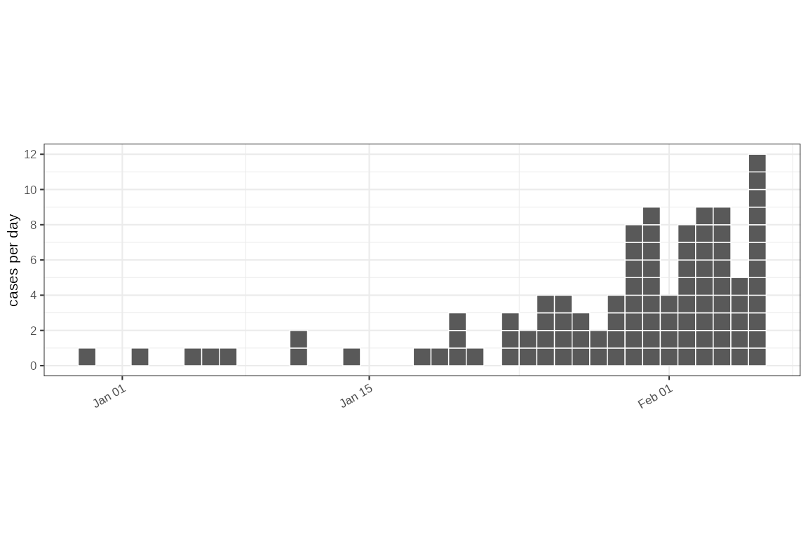
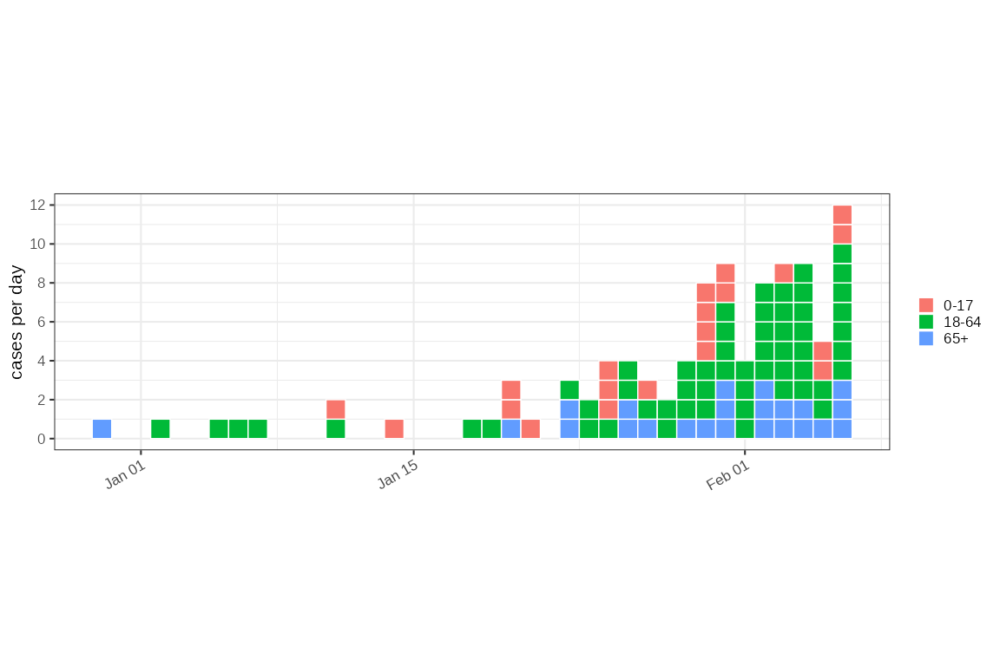
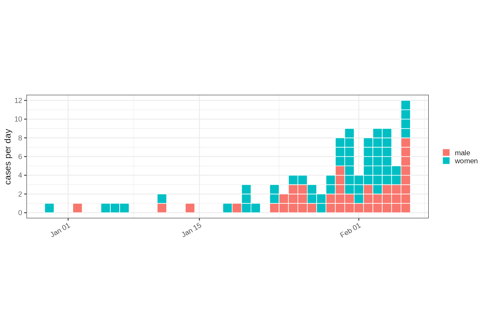
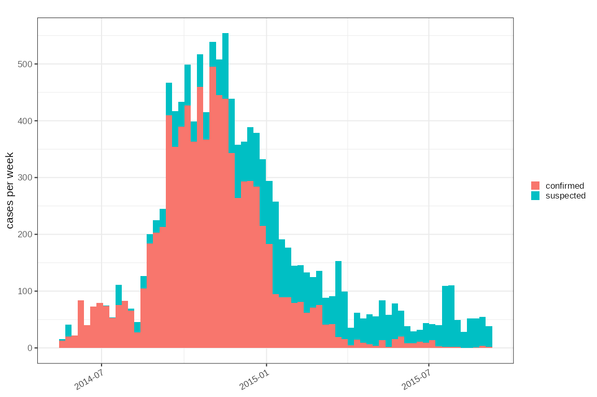
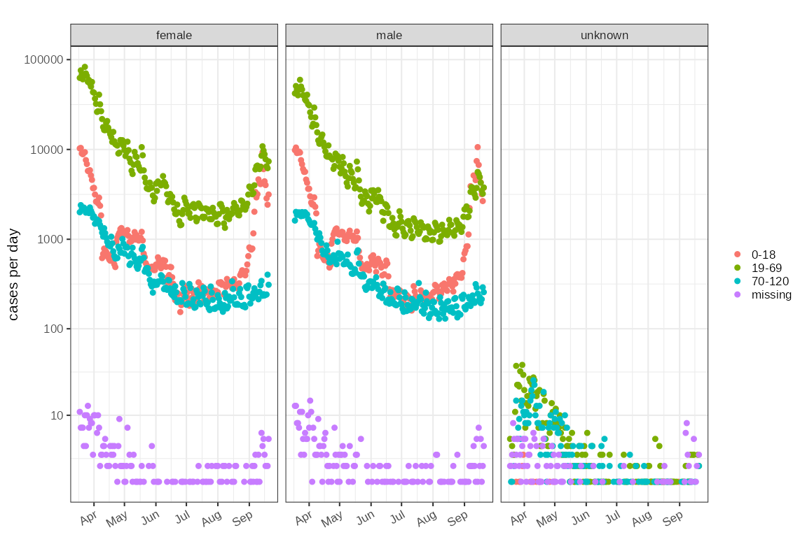

# Data wrangling and working with \`ggoutbreak\`

`ggoutbreak` assumes a consistent naming scheme for significant columns,
notably `time` and `count`, and additionally `class`, `denom`,
`population` columns. Data needs to be supplied using these column names
and to make sure the data is formatted correctly it undergoes quite
rigorous checks. One area where this can pose problems is in correct
grouping, which must make sure that each group is a single time series
of unique `time` and minimally `count` columns.

## Line lists vs. time series

Infectious disease data usually either comes as a set of observations of
an individual infection with a time stamp (i.e. a line list) or as a
count of events (e.g. positive tests, hospitalisations, deaths)
happening within a specific period (day, week, month etc.) as a time
series.

For count data there may also be a denominator known. For testing this
could be the number of tests performed, or the number of patients at
risk of hospitalisation.

For both these data types there may also be a class associated with each
observation, defining a subgroup of infections of interest. This could
be the variant of a virus, or the age group, for example. It may make
sense to compare these different subgroups against each other. In this
case the denominator may be the total of counts among all groups per
unit time. Additionally there may be information about the size of the
population for each subgroup.

`ggoutbreak` assumes for the most part that the input data is in the
form of a set of time series of counts, each of which has a unique set
of times, which are usually complete. To create datasets like this from
line lists `ggoutbreak` provides some infrastructure for dealing with
time series

## Coercing data into `ggoutbreak` format

### A simple linelist

At the lowest level a linelist might be the list of timestamps of some
observation. This is the easiest input to process and is imported into a
single column data frame.

The linelist is timestamped using a S3 `time_period` class which is
simply a numeric of defined length time units (in this case days) from
an origin (in this case `2019-12-29`). We can plot the individual cases.

``` r

# Set the default start date and unit for `ggoutbreak`:
# This is not absolutely required as will set itself but helps in the long run
set_defaults("2019-12-29","1 day")

# Timestamps of 100 cases in first 40 days with a exponential growth rate of 0.1.
lldates = as.Date("2019-12-29")+rexpgrowth(100,0.1,40)
ll = lldates %>% linelist() 
ll %>% dplyr::glimpse()
#> Rows: 100
#> Columns: 1
#> $ time <t[day]> 39.17, 22.9, 31.09, 38.32, 39.93, 33.88, 33.29, 36.65, 27.29, …
ll %>% plot_cases(individual=TRUE)
```



Supposing we had a slightly more complex input data. Maybe we also had
gender and age as well as a `onset_dates` column in a dataframe. We can
let `ggoutbreak` guess the structure of the linelist, and time stamp it.
If there are multiple date columns we could also have specified the
date:

``` r

lldf = dplyr::tibble(
  onset_dates = lldates,
  gender = rcategorical(100, c(male = 0.54, women = 0.46), factor = TRUE),
  age = rcategorical(100, c(`0-17` = 0.2, `18-64` = 0.6, `65+`=0.2), factor = TRUE)
)

# in this case we can let `ggoutbreak` guess the structure of this linelist:

ll2 = lldf %>% linelist()

ll2 %>% dplyr::glimpse()
#> Rows: 100
#> Columns: 4
#> $ onset_dates <date> 2020-02-06, 2020-01-20, 2020-01-29, 2020-02-05, 2020-02-0…
#> $ gender      <fct> women, women, male, male, male, women, male, women, male, …
#> $ age         <fct> 18-64, 65+, 18-64, 0-17, 0-17, 65+, 18-64, 18-64, 0-17, 65…
#> $ time        <t[day]> 39.17, 22.9, 31.09, 38.32, 39.93, 33.88, 33.29, 36.65, …

# And we can plot it with the data ordered how we like:
ll2 %>% 
  dplyr::arrange(dplyr::desc(age)) %>%
  plot_cases(mapping = ggplot2::aes(fill=age), individual=TRUE)
```



``` r

ll2 %>% 
  dplyr::arrange(gender) %>%
  plot_cases(mapping = ggplot2::aes(fill=gender), individual=TRUE)
```



``` r

# In this case as it is a different time we can if we like anchor the time
# series to the `start` so the time column runs from zero. In this case we are
# also going to make the time stamp count in weeks:

sl2014 = outbreaks::ebola_sierraleone_2014 %>% 
  linelist(date = date_of_onset, anchor="start", unit="weeks") %>%
  dplyr::mutate(
    age_cat = cut(age, c(0,18,65,Inf)),
    dplyr::across(dplyr::where(is.character),forcats::as_factor)
  ) %>%
  dplyr::glimpse()
#> Rows: 11,903
#> Columns: 10
#> $ id             <int> 1, 2, 3, 4, 5, 6, 7, 8, 9, 10, 11, 12, 13, 14, 15, 16, …
#> $ age            <dbl> 20, 42, 45, 15, 19, 55, 50, 8, 54, 57, 50, 27, 38, 29, …
#> $ sex            <fct> F, F, F, F, F, F, F, F, F, F, F, F, F, F, F, F, F, F, F…
#> $ status         <fct> confirmed, confirmed, confirmed, confirmed, confirmed, …
#> $ date_of_onset  <date> 2014-05-18, 2014-05-20, 2014-05-20, 2014-05-21, 2014-0…
#> $ date_of_sample <date> 2014-05-23, 2014-05-25, 2014-05-25, 2014-05-26, 2014-0…
#> $ district       <fct> Kailahun, Kailahun, Kailahun, Kailahun, Kailahun, Kaila…
#> $ chiefdom       <fct> Kissi Teng, Kissi Teng, Kissi Tonge, Kissi Teng, Kissi …
#> $ time           <t[week]> 0, 0.29, 0.29, 0.43, 0.43, 0.43, 0.43, 0.57, 0.57, …
#> $ age_cat        <fct> "(18,65]", "(18,65]", "(18,65]", "(0,18]", "(18,65]", "…
```

Plotting this is also easy, and in this case it is organised by week:

``` r
sl2014 %>%
  dplyr::arrange(status) %>%
  plot_cases(mapping = ggplot2::aes(fill=status))
```



### Count data

Count data describes the number of cases in a time period, e.g. a day, a
week etc. It may also be associated one or more major grouping, such as
age category, gender, geographical region, ethnicity, viral subtype. In
all these groups there is potentially a population denominator, but
often there is a major grouping that may define a different denominator
(e.g. total tested individuals). These categories can be arbitrarily
bought into `ggoutbreak` and managed as groups in exactly the same was
as you would in a normal `dplyr` pipeline.

Because count data needs to be unique for each group for each time point
extra checks are carried out to make sure that the count grouping is
correct:

``` r

nhs111 = outbreaks::covid19_england_nhscalls_2020 %>%
  dplyr::group_by(sex,ccg_code,ccg_name,nhs_region) %>%
  timeseries(
    class = age
  ) %>%
  dplyr::glimpse()
#> Rows: 253,670
#> Columns: 13
#> Groups: sex, ccg_code, ccg_name, nhs_region, class, site_type [3,706]
#> $ sex        <chr> "female", "female", "female", "female", "female", "female",…
#> $ ccg_code   <chr> "e38000062", "e38000163", "e38000001", "e38000002", "e38000…
#> $ ccg_name   <chr> "nhs_gloucestershire_ccg", "nhs_south_tyneside_ccg", "nhs_a…
#> $ nhs_region <chr> "South West", "North East and Yorkshire", "North East and Y…
#> $ class      <fct> missing, missing, 0-18, 0-18, 0-18, 0-18, 0-18, 0-18, 0-18,…
#> $ time       <t[day]> 80, 80, 80, 80, 80, 80, 80, 80, 80, 80, 80, 80, 80, 80, …
#> $ site_type  <chr> "111", "111", "111", "111", "111", "111", "111", "111", "11…
#> $ date       <date> 2020-03-18, 2020-03-18, 2020-03-18, 2020-03-18, 2020-03-18…
#> $ age        <chr> "missing", "missing", "0-18", "0-18", "0-18", "0-18", "0-18…
#> $ postcode   <chr> "gl34fe", "ne325nn", "bd57jr", "tn254ab", "rm13ae", "n111np…
#> $ day        <int> 0, 0, 0, 0, 0, 0, 0, 0, 0, 0, 0, 0, 0, 0, 0, 0, 0, 0, 0, 0,…
#> $ weekday    <fct> rest_of_week, rest_of_week, rest_of_week, rest_of_week, res…
#> $ count      <int> 1, 1, 8, 7, 35, 9, 11, 19, 6, 9, 27, 13, 9, 13, 20, 6, 21, …
```

In this case the level of detail may be more than we want to deal with
and aggregating groups maybe useful (mre details later):

``` r
nhs111combined = nhs111 %>% 
  dplyr::group_by(sex,class,age) %>%
  time_aggregate() %>% 
  dplyr::glimpse()
#> Rows: 1,713
#> Columns: 4
#> Groups: sex, class [12]
#> $ sex   <chr> "female", "female", "female", "female", "female", "female", "fem…
#> $ class <fct> 0-18, 0-18, 0-18, 0-18, 0-18, 0-18, 0-18, 0-18, 0-18, 0-18, 0-18…
#> $ time  <t[day]> 80, 81, 82, 83, 84, 85, 86, 87, 88, 89, 90, 91, 92, 93, 94, 9…
#> $ count <int> 10283, 10400, 9029, 8849, 9185, 9326, 7617, 6890, 5768, 5709, 58…

nhs111combined %>% plot_counts(mapping=ggplot2::aes(colour=class))+
  ggplot2::facet_wrap(~sex)+
  scale_y_log1p()
```



## More detail on time periods

A weekly case rate represents a time slice of seven days with a start
and finish date. Dates are a continuous quantity, and `cut_dates()` can
be used to classify continuous dates into periods of equal duration,
with a start date:

``` r
random_dates = Sys.Date()+sample.int(21,50,replace = TRUE)
cut_date( random_dates, unit = "1 week", anchor = "start", dfmt = "%d %b")
#> 11 Dec — 17 Dec 25 Dec — 31 Dec 25 Dec — 31 Dec 18 Dec — 24 Dec 18 Dec — 24 Dec 
#>    "2025-12-11"    "2025-12-25"    "2025-12-25"    "2025-12-18"    "2025-12-18" 
#> 18 Dec — 24 Dec 11 Dec — 17 Dec 25 Dec — 31 Dec 25 Dec — 31 Dec 25 Dec — 31 Dec 
#>    "2025-12-18"    "2025-12-11"    "2025-12-25"    "2025-12-25"    "2025-12-25" 
#> 18 Dec — 24 Dec 11 Dec — 17 Dec 25 Dec — 31 Dec 18 Dec — 24 Dec 25 Dec — 31 Dec 
#>    "2025-12-18"    "2025-12-11"    "2025-12-25"    "2025-12-18"    "2025-12-25" 
#> 11 Dec — 17 Dec 25 Dec — 31 Dec 25 Dec — 31 Dec 11 Dec — 17 Dec 11 Dec — 17 Dec 
#>    "2025-12-11"    "2025-12-25"    "2025-12-25"    "2025-12-11"    "2025-12-11" 
#> 18 Dec — 24 Dec 11 Dec — 17 Dec 18 Dec — 24 Dec 25 Dec — 31 Dec 11 Dec — 17 Dec 
#>    "2025-12-18"    "2025-12-11"    "2025-12-18"    "2025-12-25"    "2025-12-11" 
#> 25 Dec — 31 Dec 11 Dec — 17 Dec 18 Dec — 24 Dec 25 Dec — 31 Dec 18 Dec — 24 Dec 
#>    "2025-12-25"    "2025-12-11"    "2025-12-18"    "2025-12-25"    "2025-12-18" 
#> 18 Dec — 24 Dec 18 Dec — 24 Dec 25 Dec — 31 Dec 25 Dec — 31 Dec 18 Dec — 24 Dec 
#>    "2025-12-18"    "2025-12-18"    "2025-12-25"    "2025-12-25"    "2025-12-18" 
#> 11 Dec — 17 Dec 25 Dec — 31 Dec 11 Dec — 17 Dec 18 Dec — 24 Dec 18 Dec — 24 Dec 
#>    "2025-12-11"    "2025-12-25"    "2025-12-11"    "2025-12-18"    "2025-12-18" 
#> 18 Dec — 24 Dec 25 Dec — 31 Dec 25 Dec — 31 Dec 11 Dec — 17 Dec 25 Dec — 31 Dec 
#>    "2025-12-18"    "2025-12-25"    "2025-12-25"    "2025-12-11"    "2025-12-25" 
#> 25 Dec — 31 Dec 25 Dec — 31 Dec 25 Dec — 31 Dec 25 Dec — 31 Dec 18 Dec — 24 Dec 
#>    "2025-12-25"    "2025-12-25"    "2025-12-25"    "2025-12-25"    "2025-12-18"
```

Performing calculations using interval censored dates is awkward. A
numeric version of dates is useful that can keep track of both the start
date of a time series and its intrinsic duration, as a numeric. This is
the purpose of the `time_period` class:

``` r
dates = seq(as.Date("2020-01-01"),by=7,length.out = 5)
tmp = as.time_period(dates)
tmp
#> time unit: day, origin: 2019-12-29 (a Sunday)
#> 3 10 17 24 31
```

The `time_period` defaults to using the start of the first defined
`time_period` in a session as its origin and calculating a duration unit
based on the data (in this case weekly). This behaviour can be
controlled explicitly with
[`set_default_start()`](https://ai4ci.github.io/ggoutbreak/reference/set_defaults.md)
and
[`set_default_unit()`](https://ai4ci.github.io/ggoutbreak/reference/set_defaults.md),
or on an ad-hoc basis by providing the `start_date` or `anchor` and
`unit` variables to calls to
[`as.time_period()`](https://ai4ci.github.io/ggoutbreak/reference/as.time_period.md)

A usual set of S3 methods are available such as formatting, printing,
labelling, and casting `time_period`s to and from dates and `POSIXct`
classes:

``` r
suppressWarnings(labels(tmp))
#> [1] "01/Jan" "08/Jan" "15/Jan" "22/Jan" "29/Jan"
```

A weekly time series can be recast to a different frequency, or start
date:

``` r

tmp2 = as.time_period(tmp, unit = "2 days", start_date = "2020-01-01")
tmp2
#> time unit: 2 days, origin: 2020-01-01 (a Wednesday)
#> 0 3.5 7 10.5 14
```

and the original dates should be recoverable:

``` r
as.Date(tmp2)
#> [1] "2020-01-01" "2020-01-08" "2020-01-15" "2020-01-22" "2020-01-29"
```

[`date_seq()`](https://ai4ci.github.io/ggoutbreak/reference/date_seq.md)
can be used to make sure a set of periodic times is complete:

``` r

tmp3 = as.time_period(Sys.Date()+c(0:2,4:5)*7,anchor = "start")
as.Date(date_seq(tmp3))
#> [1] "2025-12-10" "2025-12-17" "2025-12-24" "2025-12-31" "2026-01-07"
#> [6] "2026-01-14"
```

`time_period`s can also be used with monthly or yearly data but such
data are not regular. This is approximately handled and irregular date
periods are generally OK to use with `ggoutbreak`. Some functions like
`date_seq` may not work as anticipated with irregular dates, and some
conversions between weeks and months, for example, are potentially
lossy.

Two time series can be aligned to make them comparable, although by
default the creation of time series means they are already comparable:

``` r

orig_dates = Sys.Date()+1:10*7

# a 2 daily time series based on weekly dates
t1 = as.time_period(orig_dates, unit = "2 days", anchor = "2021-01-01")
t1
#> time unit: 2 days, origin: 2021-01-01 (a Friday)
#> 905.5 909 912.5 916 919.5 923 926.5 930 933.5 937

# a weekly with different start date
t2 = as.time_period(orig_dates, unit = "1 week", anchor = "2022-01-01")
t2
#> time unit: week, origin: 2022-01-01 (a Saturday)
#> 206.6 207.6 208.6 209.6 210.6 211.6 212.6 213.6 214.6 215.6

# rebase t1 into the same format as t2
# as t1 and t2 based on the same original dates converting t2 onto the same
# peridicty as t1 results in an identical set of times
t3 = as.time_period(t1,t2)
t3
#> time unit: week, origin: 2022-01-01 (a Saturday)
#> 206.6 207.6 208.6 209.6 210.6 211.6 212.6 213.6 214.6 215.6

# This happens automatically when the vectors are concatented
c(t1,t2)
#> time unit: 2 days, origin: 2021-01-01 (a Friday)
#> 905.5 909 912.5 916 919.5 923 926.5 930 933.5 937 905.5 909 912.5 916 919.5 923 926.5 930 933.5 937
```

## Times in `ggoutbreak` and conversion of line-lists

`ggoutbreak` uses the `time_period` class internally extensively.
Casting dates to and from `time_periods` is all that generally needs to
be done before using `ggoutbreak` and this is done automatically by
[`linelist()`](https://ai4ci.github.io/ggoutbreak/reference/linelist.md)
and
[`timeseries()`](https://ai4ci.github.io/ggoutbreak/reference/timeseries.md)
functions. Most of the functions in `ggoutbreak` operate on time series
data which expect a unique (and usually complete) set of data on a
periodic time.

To help prepare line-list data into time series there is the
[`time_summarise()`](https://ai4ci.github.io/ggoutbreak/reference/time_summarise.md)
function. A minimal line-list will have a date column and nothing else.
From this we can generate a count of cases over a specific time unit:

``` r

random_dates = Sys.Date()+sample.int(21,50,replace = TRUE)
linelist = dplyr::tibble(date = random_dates)
linelist %>% time_summarise(unit="1 week") %>% dplyr::glimpse()
#> Rows: 3
#> Columns: 2
#> $ time  <t[week]> 0, 1, 2
#> $ count <int> 16, 20, 14
```

If the line-list contains a `class` column it is interpreted as a
complete record of all possible options from which we can calculate a
denominator. In this case the positive and negative results of a test:

``` r

random_dates = Sys.Date()+sample.int(21,200,replace = TRUE)
linelist2 = dplyr::tibble(
  date = random_dates,
  class = stats::rbinom(200, 1, 0.04) %>% ifelse("positive","negative")
)
linelist2 %>% time_summarise(unit="1 week") %>% dplyr::glimpse()
#> Rows: 6
#> Columns: 4
#> Groups: class [2]
#> $ class <chr> "negative", "negative", "negative", "positive", "positive", "pos…
#> $ time  <t[week]> 0, 1, 2, 0, 1, 2
#> $ count <int> 66, 76, 53, 2, 2, 1
#> $ denom <int> 68, 78, 54, 68, 78, 54
```

In this specific example subsequent analysis with `ggoutbreak` may focus
on the `positive` subgroup only, as the comparison between `positive`
and `negative` test results is trivial. In another example `class` may
not be test results, it could be any other major subdivision e.g. the
variant of a disease. In this case the comparison between different
groups may be much more relevant. The use of `class` as the major
sub-group is for convenience. Additional grouping other than `class`
columns is also possible for multi-faceted comparisons, and grouping is
preserved but not included automatically in the denominator, which may
need to be manually calculated:

``` r

random_dates = Sys.Date()+sample.int(21,200,replace = TRUE)
variant = apply(stats::rmultinom(200, 1, c(0.1,0.3,0.6)), MARGIN = 2, function(x) which(x==1))

linelist3 = dplyr::tibble(
  date = random_dates,
  class = c("variant1","variant2","variant3")[variant],
  gender = ifelse(stats::rbinom(200,1,0.5),"male","female")
)
  
count_by_gender = linelist3 %>% 
  dplyr::group_by(gender) %>% 
  time_summarise(unit="1 week") %>% 
  dplyr::arrange(time, gender, class) %>%
  dplyr::glimpse()
#> Rows: 18
#> Columns: 5
#> Groups: gender, class [6]
#> $ gender <chr> "female", "female", "female", "male", "male", "male", "female",…
#> $ class  <chr> "variant1", "variant2", "variant3", "variant1", "variant2", "va…
#> $ time   <t[week]> 0, 0, 0, 0, 0, 0, 1, 1, 1, 1, 1, 1, 2, 2, 2, 2, 2, 2
#> $ count  <int> 2, 9, 28, 6, 10, 16, 2, 13, 22, 3, 6, 22, 2, 10, 22, 2, 10, 15
#> $ denom  <int> 39, 39, 39, 32, 32, 32, 37, 37, 37, 31, 31, 31, 34, 34, 34,…
```

## Aggregating time series datasets.

In the case of a time series with additional grouping present, removing
a level of grouping whilst retaining time is made easier with
[`time_aggregate()`](https://ai4ci.github.io/ggoutbreak/reference/time_aggregate.md).
In this case we wish to sum `count` and `denom` by gender, retaining the
class grouping.

``` r

count_by_gender %>% 
  dplyr::group_by(class,gender) %>% 
  time_aggregate() %>%
  dplyr::glimpse()
#> Rows: 9
#> Columns: 4
#> Groups: class [3]
#> $ class <chr> "variant1", "variant1", "variant1", "variant2", "variant2", "var…
#> $ time  <t[week]> 0, 1, 2, 0, 1, 2, 0, 1, 2
#> $ count <int> 8, 5, 4, 19, 19, 20, 44, 44, 37
#> $ denom <int> 71, 68, 61, 71, 68, 61, 71, 68, 61
```

by default `time_aggregate` will sum any of `count`, `denom` and
`population` columns but any other behaviour can be specified by passing
[`dplyr::summarise`](https://dplyr.tidyverse.org/reference/summarise.html)
style directives to the function.
