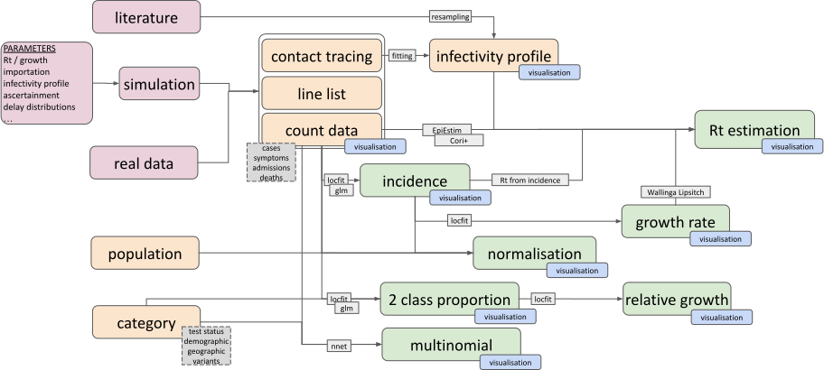

```{r setup, include=FALSE}

knitr::opts_chunk$set(
  collapse = TRUE,
  comment = "#>",
  echo = TRUE,
  warning = FALSE,
  message = FALSE,
  fig.width = 6,
  fig.height = 4
)

here::i_am("vignettes/ggoutbreak.Rmd")
source(here::here("vignettes/vignette-utils.R"))
library(ggoutbreak)
library(patchwork)

```

# Background

Collection of tools from COVID-19 with focus on simplicity with a goal to provide
a simple pipeline from data to visualisation

https://github.com/ai4ci/ggoutbreak and AI4CI r-universe

Simulation

* Poisson (aggregate count) & branching process (line list)
* Time varying parametrisations
* Test harness for estimators, including scoring metrics.

Estimation

* Collection of methods for incidence, growth rate, reproduction number
 (and wrappers for existing tools)
* Poisson count and binomial/multinomial proportion models

Visualization



# Simulation

## Models:

* Poisson growth rate
* Poisson reproduction number
* Branching process model
* SEIR ODE

## Time varying parameters:

* Rt / growth rate
* Importation
* Generation time
* Ascertainment
* Delay to observation, e.g. symptoms, admissions, death
* Contact matrices
* Dispersion

## Scoring

* mean_quantile_bias - the average of the universal residuals. Lower values
are better.
* mean_trans_bias - the bias on the link function scale.
* link - the link function
* mean_bias - the bias on the natural scale (which may be interpreted as
additive or multiplicative depending on the link)
* pit_was - an unadjusted probability integral transform histogram
Wasserstein distance from the uniform (lower values are better).
* unbiased_pit_was - an PIT Wasserstein distance from the uniform, adjusted
for estimator bias (lower values are better).
* directed_pit_was - a PIT Wasserstein distance from the uniform, directed
away from the centre, adjusted for estimator bias (values closer to zero
are better, positive values indicate overconfidence, and negative values
excessively conservative estimates).
* percent_iqr_coverage - the percentage of estimators that include the true
value in their IQR. For a perfectly calibrated estimate this should be 0.5.
Lower values reflect overconfidence, higher values reflect excessively
conservative estimates.
* unbiased_percent_iqr_coverage - the percentage of estimators that include
the true value in their IQR once adjusted for bias
* mean_crps - the mean value of the continuous rank probability score for
each point estimate (lower values are better)
* mean_unbiased_crps - the mean value of the continuous rank probability
score for each point estimate assessed after adjustment for bias (lower
values are better)

# Estimation methods

* Rapid simple estimates over multiple sub-groups
* Supports daily / weekly / monthly / yearly time series*
* Testing estimators against simulations

## Infectivity profile estimation

* Estimation of generation time or serial interval
* From published estimates (including uncertainty)
* Resampled from raw interval data (with bootstrapping for uncertainty)
* From posterior estimates of a fitted gamma distribution

## Poisson rate models

* Locfit or GLM fitted time varying quasipoisson model.
* Estimates incidence and growth rate
* Normalisation per capita population or to population baseline rate

## Binomial proportion models

* Locfit or GLM fitted time varying quasibinomial model.
* Estimates proportion and relative growth rate
* Normalisation against population baseline risk

## Multinomial proportion models:


## $R_t$ estimation methods:

### EpiEstim wrapper

### Reimplementation of Cori method

* Inputs raw incidence time series
* Reimplementation integrates estimates from a range of time windows
* Handles missing data.
* Less lag and more uncertainty.

### Wallinga and Lipsitch growth rates method

* Inputs an exponential growth rate time series estimate (assumed normally distributed)
* Uses MGF of discrete SI distribution
* Monte-Carlo resampling for propagation of uncertainty 
* Moderately slow

### $R_t$ from modelled incidence

* Inputs a log-normally distributed incidence estimate.
* Propagates uncertainty in infectivity profile and incidence data
* Deterministic & tolerant of missing values. 
* Can use weekly count time series.
* Can deal with negative values in serial interval

